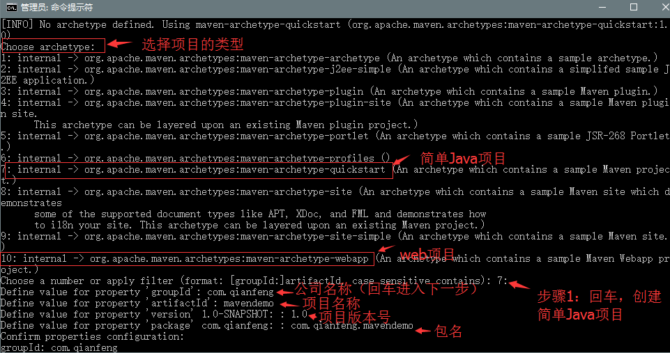

# Maven项目构建（三）：Maven的基本使用

```
导读：本节将使用Maven完成项目的构建，学习技术的最好的方法就是三个字：练、练、练...接下来，就要动手使用Maven了。
```

## 一、Maven的目录结构

开始使用Maven构建项目，首先了解一下Maven项目的目录结构。

~~~
project

	-src

	----main

	------java（所有的java源文件）

	------resources（配置文件）

	------webapp(如果是web工程才有此目录，类似eclipse中的webcontent)

	----test（测试文件）

	-pom.xml（是项目的核心配置文件，包含jar、版本信息等内容）

~~~

##二、POM文档说明

~~~
<project xmlns="http://maven.apache.org/POM/4.0.0" xmlns:xsi="http://www.w3.org/2001/XMLSchema-instance"
  xsi:schemaLocation="http://maven.apache.org/POM/4.0.0 http://maven.apache.org/xsd/maven-4.0.0.xsd">
  <modelVersion>4.0.0</modelVersion>

	<!--公司名称 -->
  <groupId>com.qianfeng</groupId>
  <!-- 项目名称-->
  <artifactId>mavendemo</artifactId>
  <!-- 项目版本号-->
  <version>1.0</version>
  <!-- 打包的类型，非web项目，包类型是jar，web项目的包是war-->
  <packaging>jar</packaging>
	<!--项目的名称 -->
  <name>mavendemo</name>
  <url>http://maven.apache.org</url>
	<!--编码格式为UTF-8 -->
  <properties>
    <project.build.sourceEncoding>UTF-8</project.build.sourceEncoding>
  </properties>

<!-- 依赖配置 （就是jar文件的配置）-->
  <dependencies>
  		<!--添加了一个junit的jar文件 -->
    <dependency>
      <groupId>junit</groupId>
      <artifactId>junit</artifactId>
      <version>3.8.1</version>
      <scope>test</scope>
    </dependency>
    
  </dependencies>
</project>
~~~

## 三、基本使用

###3.1、创建Maven项目

~~~
步骤：
1、在F盘新建一个文件夹maven_demo用来存放maven项目。
2、window进入cmd命令行。
3、输入mvn archetype:generate 开始创建项目。出现如下界面：
~~~



按照上图的步骤说明进行操作。

### 3.2、编码


### 3.3、测试

