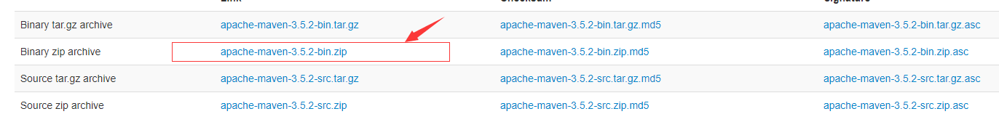
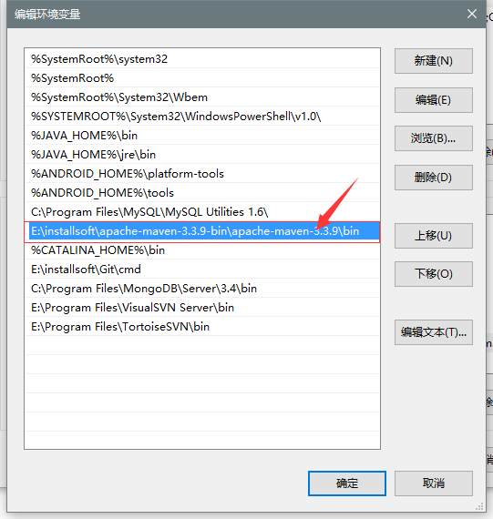
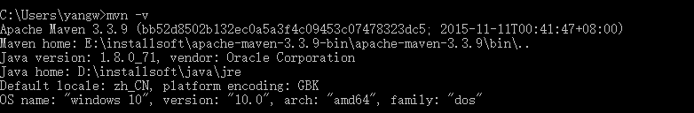
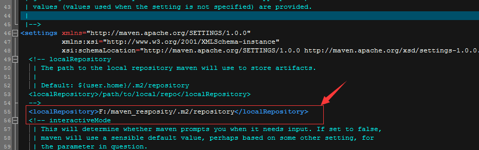

# Maven项目构建（二）：Maven安装和配置

```
导读：上一节我们介绍了什么是Maven，以及Maven的好处，我们学习Maven的必要性。明白了这些之后，我们就要开始动手配置和使用Maven了。
```

## 一、安装JDK

Maven毕竟是一个Java构建工具，依赖Java运行环境。所以，安装JDK是首要条件。

不过，对于已经看到这篇文章的读者，应该至少已经写过Java程序了。所以，详细的JDK安装和配置流程就不再赘述。大家自行安装、检查~

## 二、安装Maven

### 2.1、下载Maven

下载地址：http://maven.apache.org/，下载点击如图：



### 2.2、解压

将下载的Maven安装包进行解压，我解压后的路径：E:\installsoft\apache-maven-3.3.9-bin   ，大家可以自行解压到磁盘的任何位置。


### 2.3、配置环境变量

因为接下来我们会像使用java和javac命令一样使用Maven，所以需要配置环境变量，方便后续的使用。类似配置java环境变量一样，在windows环境变量配置中加入如下图中蓝色部分内容：



### 2.4、测试

测试Maven的环境变量是否配置成功，打开cmd，输入**mvn -v**，出现如下信息，则表示配置成功：



至此，Maven的安装就算成功了。但是如果想更好、更畅通使用（对~就是畅通，因为大陆对某些IP的限制原因），还需要接着进行如下配置。

## 三、配置Maven的仓库

Maven构建项目的时候，会自动下载依赖的Jar文件。所以，需要配置用来存放这些jar文件的本地仓库（默认仓库地址在C盘user目录下）。我们将仓库地址修改为F:\maven_resposity\.m2\repository。

配置方式：

打开Maven安装目录下的settings.xml文件（地址：E:\installsoft\apache-maven-3.3.9-bin\apache-maven-3.3.9\conf\settings.xml），在<settings ...>跟标签下添加配置:

~~~
<localRepository>F:/maven_resposity/.m2/repository</localRepository>
~~~

添加后的配置如下：



## 四、配置Maven的阿里云镜像

因为大陆对某些国外IP的限制，导致Maven自动下载一些jar文件的时候会报异常。我们需要修改Maven镜像为阿里云镜像，方便项目构建过程中的Jar文件下载。

1、打开_E:\installsoft\apache-maven-3.3.9-bin\apache-maven-3.3.9\conf\settings.xml_文件。在160行左右，添加如下内容：

~~~
<mirror>
	    <id>nexus-aliyun</id>
	    <mirrorOf>*</mirrorOf>
	    <name>Nexus aliyun</name>
	    <url>http://maven.aliyun.com/nexus/content/groups/public</url>
	</mirror>
~~~


## 五、总结

本节内容是Maven的下载、环境变量配置、本地仓库配置、阿里云镜像配置。这些，都是为了后面使用Maven而作的铺垫。