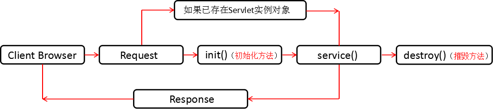

#  Java面试题

## 一、Java基础篇

### 1.1、多线程篇

#### 1.1.1、Java中多线程同步是什么?

```
在多线程程序下，同步能控制对共享资源的访问。如果没有同步，当一个Java线程在修改一个共享变量时，另外一个线程正在使用或者更新同一个变量，这样容易导致程序出现错误的结果。
```

#### 2、解释实现多线程的几种方法?

```html
一Java线程可以实现Runnable接口或者继承Thread类来实现，当你打算多重继承时，优先选择实现Runnable。
```

#### 3、Thread.start()与Thread.run()有什么区别?

```
Thread.start()方法(native)启动线程，使之进入就绪状态，当cpu分配时间该线程时，由JVM调度执行run()方法。
```

#### 4、为什么需要run()和start()方法，我们可以只用run()方法来完成任务吗?

```
我们需要run()&start()这两个方法是因为JVM创建一个单独的线程不同于普通方法的调用，所以这项工作由线程的start方法来完成，start由本地方法实现，需要显示地被调用，使用这俩个方法的另外一个好处是任何一个对象都可以作为线程运行，只要实现了Runnable接口，这就避免因继承了Thread类而造成的Java的多继承问题。
```

#### 5、什么是ThreadLocal类，怎么使用它?

```
ThreadLocal是一个线程级别的局部变量，并非“本地线程”。ThreadLocal为每个使用该变量的线程提供了一个独立的变量副本，每个线程修改副本时不影响其它线程对象的副本。

下面是线程局部变量(ThreadLocal variables)的关键点：

一个线程局部变量(ThreadLocal variables)为每个线程方便地提供了一个单独的变量。
ThreadLocal实例通常作为静态的私有的(privatestatic)字段出现在一个类中，这个类用来关联一个线程。
当多个线程访问ThreadLocal实例时，每个线程维护ThreadLocal提供的独立的变量副本。
常用的使用可在DAO模式中见到，当DAO类作为一个单例类时，数据库链接(connection)被每一个线程独立的维护，互不影响。(基于线程的单例)
```

#### 6、什么时候抛出IllegalMonitorStateException异常，为什么?

```
调用wait()/notify()/notifyAll()中的任何一个方法时，如果当前线程没有获得该对象 的锁，那么就会抛出IllegalMonitorStateException的异常(也就是说程序在没有执行对象的任何同步块或者同步方法时，仍然尝试调用wait()/notify()/notifyAll()时)。由于该异常是RuntimeExcpetion的子类，所以该异常不一定要捕获(尽管 你可以捕获只要你愿意).作为RuntimeException，此类异常不会在wait(),notify(),notifyAll()的方法签名提及。
```

#### 7、Sleep()、suspend()和wait()之间有什么区别?

```
Thread.sleep()使当前线程在指定的时间处于“非运行”(NotRunnable)状态。线程一直持有对象的监视器。比如一个线程当前在一个同步块或同步方法中，其它线程不能进入该块或方法中。如果另一线程调用了 interrupt()方法，它将唤醒那个“睡眠的”线程。

注意：sleep()是一个静态方法。这意味着只对当前线程有效，一个常见的错误是调用t.sleep()，(这里的t是一个不同于当前线程的线 程)。即便是执行t.sleep()，也是当前线程进入睡眠，而不是t线程。t.suspend()是过时的方法，使用suspend()导致线程进入停 滞状态，该线程会一直持有对象的监视器，suspend()容易引起死锁问题。

object.wait()使当前线程出于“不可运行”状态，和sleep()不同的是wait是object的方法而不是thread。调用 object.wait()时，线程先要获取这个对象的对象锁，当前线程必须在锁对象保持同步，把当前线程添加到等待队列中，随后另一线程可以同步同一个对象锁来调用object.notify()，这样将唤醒原来等待中的线程，然后释放该锁。基本上wait()/notify()与sleep() /interrupt()类似，只是前者需要获取对象锁。
```

#### 8、在静态方法上使用同步时会发生什么事?

同步静态方法时会获取该类的“Class”对象，所以当一个线程进入同步的静态方法中时，线程监视器获取类本身的对象锁，其它线程不能进入这个类的任何静态同步方法。它不像实例方法，因为多个线程可以同时访问不同实例同步实例方法。

#### 9、当一个同步方法已经执行，线程能够调用对象上的非同步实例方法吗?

可以，一个非同步方法总是可以被调用而不会有任何问题。实际上，Java没有为非同步方法做任何检查，锁对象仅 仅在同步方法或者同步代码块中检查。如果一个方法没有声明为同步，即使你在使用共享数据Java照样会调用，而不会做检查是否安全，所以在这种情况下要特 别小心。一个方法是否声明为同步取决于临界区访问(critial section access),如果方法不访问临界区(共享资源或者数据结构)就没必要声明为同步的。

#### 10、 在一个对象上两个线程可以调用两个不同的同步实例方法吗?

不能，因为一个对象已经同步了实例方法，线程获取了对象的对象锁。所以只有执行完该方法释放对象锁后才能执行其它同步方法。看下面代码示例非常清晰：Common 类 有synchronizedMethod1()和synchronizedMethod2()方法，MyThread调用这两个方法。

#### 11、 什么是死锁

死锁就是两个或两个以上的线程被无限的阻塞，线程之间相互等待所需资源。这种情况可能发生在当两个线程尝试获取其它资源的锁，而每个线程又陷入无限等待其它资源锁的释放，除非一个用户进程被终止。就JavaAPI而言，线程死锁可能发生在一下情况。

●当两个线程相互调用Thread.join()

●当两个线程使用嵌套的同步块，一个线程占用了另外一个线程必需的锁，互相等待时被阻塞就有可能出现死锁。

#### 12、什么是线程饿死，什么是活锁?

线程饿死和活锁虽然不想是死锁一样的常见问题，但是对于并发编程的设计者来说就像一次邂逅一样。

当所有线程阻塞，或者由于需要的资源无效而不能处理，不存在非阻塞线程使资源可用。JavaAPI中线程活锁可能发生在以下情形：

●当所有线程在程序中执行Object.wait(0)，参数为0的wait方法。程序将发生活锁直到在相应的对象上有线程调用Object.notify()或者Object.notifyAll()。

●当所有线程卡在无限循环中。

#### 13.什么是线程?

线程是操作系统能够进行运算调度的最小单位，它被包含在进程之中，是进程中的实际运作单位。程序员可以通过它进行多处理器编程，你可以使用多线程对运算密集型任务提速。比如，如果一个线程完成一个任务要100毫秒，那么用十个线程完成改任务只需10毫秒。Java在语言层面对多线程提供了卓越的支持，它也是一个很好的卖点。

#### 14.线程和进程有什么区别?

线程是进程的子集，一个进程可以有很多线程，每条线程并行执行不同的任务。不同的进程使用不同的内存空间，而所有的线程共享一片相同的内存空间。别把它和栈内存搞混，每个线程都拥有单独的栈内存用来存储本地数据。

#### 15.如何在Java中实现线程?

在语言层面有两种方式。java.lang.Thread 类的实例就是一个线程但是它需要调用java.lang.Runnable接口来执行，由于线程类本身就是调用的Runnable接口所以你可以继承java.lang.Thread 类或者直接调用Runnable接口来重写run()方法实现线程。

####16.Java多线程有几种实现方法,都是什么?哪一种方式比较优秀?同步有几种实现方法,都是什么?

Java多线程有两种实现方法，分别是继承Thread类与实现Runnable接口，其中实现Runnable接口比较好，因为实现类可以实现多个接口，而只能继承一个类。同步的实现方面有两种，分别是synchronized,wait与notify。

#### 17.Java实现线程用Runnable还是Thread?

这个问题是上题的后续，大家都知道我们可以通过继承Thread类或者调用Runnable接口来实现线程，问题是，那个方法更好呢?什么情况下使用它?这个问题很容易回答，如果你知道Java不支持类的多重继承，但允许你调用多个接口。所以如果你要继承其他类，当然是调用Runnable接口好了。

#### 18.Thread类中的start() 和 run() 方法有什么区别?

这个问题经常被问到，但还是能从此区分出面试者对Java线程模型的理解程度。start()方法被用来启动新创建的线程，而且start()内部调用了run()方法，这和直接调用run()方法的效果不一样。当你调用run()方法的时候，只会是在原来的线程中调用，没有新的线程启动，start()方法才会启动新线程。

#### 19.为什么我们调用start()方法时会执行run()方法，为什么我们不能直接调用run()方法?

这是另一个非常经典的java多线程面试问题。这也是我刚开始写线程程序时候的困惑。现在这个问题通常在电话面试或者是在初中级Java面试的第一轮被问到。这个问题的回答应该是这样的，当你调用start()方法时你将创建新的线程，并且执行在run()方法里的代码。但是如果你直接调用run()方法，它不会创建新的线程也不会执行调用线程的代码。

#### 20.在java中wait和sleep方法的不同?

sleep()是Thread类中的方法，而wait()则是Object类中的方法。
sleep()方法导致了程序暂停，但是他的监控状态依然保持着，当指定的时间到了又会自动恢复运行状态。在调用sleep()方法的过程中，线程不会释放对象锁。
wait()方法会导致线程放弃对象锁，进入等待此对象的等待锁定池，只有针对此对象调用notify()方法后本线程才进入对象锁定池准备获取对象锁进入运行状态。

#### 21.Java中Runnable和Callable有什么不同?

Runnable和Callable都代表那些要在不同的线程中执行的任务。Runnable从JDK1.0开始就有了，Callable是在JDK1.5增加的。它们的主要区别是Callable的 call() 方法可以返回值和抛出异常，而Runnable的run()方法没有这些功能。Callable可以返回装载有计算结果的Future对象。

#### 21.Java中CyclicBarrier 和 CountDownLatch有什么不同?

CyclicBarrier 和 CountDownLatch 都可以用来让一组线程等待其它线程。与 CyclicBarrier 不同的是，CountdownLatch 不能重新使用。

#### 22.用Java实现阻塞队列

这是一个相对艰难的Java多线程面试问题，它能达到很多的目的。第一，它可以检测侯选者是否能实际的用Java线程写程序;第二，可以检测侯选者对并发场景的理解，并且你可以根据这个问很多问题。如果他用wait()和notify()方法来实现阻塞队列，你可以要求他用最新的Java 5中的并发类来再写一次。

#### 23.Java中你怎样唤醒一个阻塞的线程?

这是个关于线程和阻塞的棘手的问题，它有很多解决方法。如果线程遇到了IO阻塞，我并且不认为有一种方法可以中止线程。如果线程因为调用wait()、sleep()、或者join()方法而导致的阻塞，你可以中断线程，并且通过抛出InterruptedException来唤醒它。

#### 24、volatile的作用

volatile所修饰的变量不保留拷贝，直接访问主内存中的。

在Java内存模型中，有main memory，每个线程也有自己的memory (例如寄存器)。为了性能，一个线程会在自己的memory中保持要访问的变量的副本。这样就会出现同一个变 量在某个瞬间，在一个线程的memory中的值可能与另外一个线程memory中的值，或者main memory中的值不一致的情况。 一个变量声明为volatile，就意味着这个变量是随时会被其他线程修改的，因此不能将它cache在线程memory中。

#### 25、synchronized的作用

当synchronized用来修饰一个方法或者一个代码块的时候，能够保证在同一时刻最多只有一个线程执行该段代码。

一、当两个并发线程访问同一个对象object中的这个synchronized(this)同步代码块时，一个时间内只能有一个线程得到执行。另一个线程必须等待当前线程执行完这个代码块以后才能执行该代码块。

二、然而，当一个线程访问object的一个synchronized(this)同步代码块时，另一个线程仍然可以访问该object中的非synchronized(this)同步代码块。

三、尤其关键的是，当一个线程访问object的一个synchronized(this)同步代码块时，其他线程对object中所有其它synchronized(this)同步代码块的访问将被阻塞。

四、当一个线程访问object的一个synchronized(this)同步代码块时，它就获得了这个object的对象锁。结果，其它线程对该object对象所有同步代码部分的访问都被暂时阻塞。

五、以上规则对其它对象锁同样适用.

#### 26、volatile与synchronized的区别

一、volatile是变量修饰符，而synchronized则作用于一段代码或方法。

二、volatile只是在线程内存和“主”内存间同步某个变量的值;而synchronized通过锁定和解锁某个监视器同步所有变量的值。显然synchronized要比volatile消耗更多资源

Thread.Sleep() 本身的含义是当前线程挂起一定时间，使得其他线程可以和当前线程再次的抢占Cpu资源。Thread.yield()是暂停当前正在执行的线程对象，并执行其他线程。概念上差不多，那么两者之间的区别是什么呢?

#### 27、线程的sleep()方法和yield()的区别:

① sleep()方法给其他线程运行机会时不考虑线程的优先级，因此会给低优先级的线程以运行的机会;yield()方法只会给相同优先级或更高优先级的线程以运行的机会;

②线程执行sleep()方法后转入阻塞(blocked)状态，而执行yield()方法后转入就绪(ready)状态;

③ sleep()方法声明抛出InterruptedException，而yield()方法没有声明任何异常;

④ sleep()方法比yield()方法(跟操作系统CPU调度相关)具有更好的可移植性.

在正式开始之前，我们先来回顾一下线程同步和线程调度的基本概念：

线程同步：即当有一个线程在对内存进行操作时，其他线程都不可以对这个内存地址进行操作，直到该线程完成操作，其他线程才能对该内存地址进行操作，而其他线程又处于等待状态，目前实现线程同步的方法有很多，临界区对象就是其中一种。

线程调度：是指按照特定机制为多个线程分配CPU的使用权.

那么，与线程同步以及线程调度相关的方法有哪些呢?

-wait()：使一个线程处于等待(阻塞)状态，并且释放所持有的对象的锁;

-sleep()：使一个正在运行的线程处于睡眠状态，是一个静态方法，调用此方法要处理InterruptedException异常;

-notify()：唤醒一个处于等待状态的线程，当然在调用此方法的时候，并不能确切的唤醒某一个等待状态的线程，而是由JVM确定唤醒哪个线程，而且与优先级无关;

-notityAll()：唤醒所有处于等待状态的线程，该方法并不是将对象的锁给所有线程，而是让它们竞争，只有获得锁的线程才能进入就绪状态;

#### 28、进程与线程的概念

进程：是并发执行的程序在执行过程中分配和管理资源的基本单位，是一个动态概念，竟争计算机系统资源的基本单位。每一个进程都有一个自己的地址空间，即进程空间或(虚空间)。进程空间的大小 只与处理机的位数有关，一个 16 位长处理机的进程空间大小为 216 ，而 32 位处理机的进程空间大小为 232 。进程至少有 5 种基本状态，它们是：初始态，执行态，等待状态，就绪状态，终止状态。

线程：在网络或多用户环境下，一个服务器通常需要接收大量且不确定数量用户的并发请求，为每一个请求都创建一个进程显然是行不通的，——无论是从系统资源开销方面或是响应用户请求的效率方面来看。因此，操作系统中线程的概念便被引进了。线程，是进程的一部分，一个没有线程的进程可以被看作是单线程的。线程有时又被称为轻权进程或轻量级进程，也是 CPU 调度的一个基本单位。

说到这里，我们对进程与线程都有了一个大体上的印象，现在开始说说二者大致的区别。

#### 29、进程与线程的区别联系

进程的执行过程是线状的，尽管中间会发生中断或暂停，但该进程所拥有的资源只为该线状执行过程服务。一旦发生进程上下文切换，这些资源都是要被保护起来的。这是进程宏观上的执行过程。而进程又可有单线程进程与多线程进程两种。我们知道，进程有一个进程控制块PCB，相关程序段和该程序段对其进行操作的数据结构集这三部分，单线程进程的执行过程在宏观上是线性的，微观上也只有单一的执行过程;而多线程进程在宏观上的执行过程同样为线性的，但微观上却可以有多个执行操作(线程)，如不同代码片段以及相关的数据结构集。线程的改变只代表了CPU执行过程的改变，而没有发生进程所拥有的资源变化。除了CPU之外，计算机内的软硬件资源的分配与线程无关，线程只能共享它所属进程的资源。与进程控制表和 PCB 相似，每个线程也有自己的线程控制表TCB，而这个TCB中所保存的线程状态信息则要比PCB表少得多，这些信息主要是相关指针用堆栈(系统栈和用户栈)，寄存器中的状态数据。进程拥有一个完整的虚拟地址空间，不依赖于线程而独立存在;反之，线程是进程的一部分，没有自己的地址空间，与进程内的其他线程一起共享分配给该进程的所有资源。

线程可以有效地提高系统的执行效率，但并不是在所有计算机系统中都是适用的，如某些很少做进程调度和切换的实时系统。使用线程的好处是有多个任务需要处理机处理时，减少处理机的切换时间;而且，线程的创建和结束所需要的系统开销也比进程的创建和结束要小得多。最适用使用线程的系统是多处理机系统和网络系统或分布式系统。


### 1.2、Java集合相关面试题

#### 1、Collection和Collections的差别

java.util.Collection 是一个集合接口，Collection接口在Java类库中有非常多详细的实现。比如List、Set

java.util.Collections 是针对集合类的一个帮助类，它提供了一系列的静态方法实现对各种集合的搜索、排序、线程安全化等操作。

#### 2、array 和 arraylist 的区别?

· Array 类似 object 集合类型，大小固定

· Arraylist 是同质和异质元素的集合

####  3、Iterator、ListIterator 和 Enumeration的区别?

· Enumeration 接口在 Java1.2 版本开始有，所以 Enumeration 是合法规范的接口

· Enumeration 使用 elements() 方法

· Iterator 对所有 Java 集合类都有实现

· Iterator 使用 iterator 方法

· Iterator 只能往一个方向前进

· ListIterator 仅仅对 List 类型的类实现了

· ListIterator 使用 listIterator ()方法

####  4、Java 中 Set 与 List 有什么不同?

· Set 是一个不允许重复元素存在的集合

· Set 没有索引

· Set 仅仅允许一个 null 值

· Set 有类： HashSet 、LinkedHashMap 、 TreeSet

· List 有索引

· List 允许 N 个 null 值

· List 可以按插入顺序显示

· List 有类： Vector 、ArrayList 、 LinkedList

#### 5、arraylist 与 vector 的区别?

· Vector 在 Java 的第一个版本就引入了，也就是说 vector 是一个合法规范的类

· ArrayList 在 Java1.2 版本引入的，是 Java 集合框架的组成部分

· Vector 是同步的

· ArrayList 是不同步的

####  6、ArrayList与Vector的差别

这两个类都实现了List接口(List接口继承自Collection接口)。它们都是有序集合。它们内部的元素都是能够反复的，都能够依据序号取出当中的某一元素。

它们两个的差别在于：

(1)、线程安全的问题：Vector是早期Java就有的，是同意多线程操作的。是线程安全的;而ArrayList是在Java2中才出现，它是线程不安全的，仅仅能使用单线程操作。因为Vector支持多线程操作，所以在性能上就比不上ArrayList了。

相同的HashTable相比于HashMap也是支持多线程的操作而导致性能不如HashMap。

(2)、数据增长的问题

ArrayList和Vector都有一个初始的容量大小，当存储进去它们里面的元素个数超出容量的时候。就须要添加ArrayList和Vector的存储空间，每次添加存储空间的时候不是仅仅添加一个存储单元。是添加多个存储单元。

Vector默认添加原来的一倍，ArrayList默认添加原来的0.5倍。

Vector能够由我们自己来设置增长的大小，ArrayList没有提供相关的方法。

####  7、LinkedList与ArrayList有什么差别

两者都实现的是List接口。不同之处在于：

(1)、ArrayList是基于动态数组实现的，LinkedList是基于链表的数据结构。

(2)、get訪问List内部随意元素时。ArrayList的性能要比LinkedList性能好。LinkedList中的get方法是要依照顺序从列表的一端開始检查，直到还有一端

(3)、对于新增和删除操作LinkedList要强于ArrayList。由于ArrayList要移动数据

#### 8、comparable 和 comparator的不同之处?

· comparable 接口实际上是出自 java.lang 包

·它有一个 compareTo(Object obj) 方法来将objects 排序

· comparator 接口实际上是出自 java.util 包

·它有一个compare(Object obj1, Object obj2) 方法来将 objects 排序

#### 9、HashMap与HashTable的差别

两者都实现了Map接口。主要差别在于：

·同步或线程安全

· Null 键和 Null 值

·迭代值

·默认容量大小

#### 10、List与Map的差别

List是存储单列数据的集合，Map是存储key和value这样双列数据的集合，List中存储的数据是有顺序的，而且同意反复。

Map其中存储的数据是没有顺序的，它存储的key是不能反复的，value是能够反复的。

List继承Collection接口，Map不是。Map没有父类

#### 11、fail-fast 与 fail-safe 之间的区别?

· Fail fast 快速地报告任何的 failure 。无论何时任何一个问题都会引发 fail fast 系统 fails

·在Java Fail fast 迭代器中，迭代 objects 集合有时会出现并发修改异常，出现这种情况有 2 个原因

·如果一个线程正在迭代一个集合，而另一个线程同时试图修改这个集合

·在调用remove() 方法后，如何我们还试图去修改集合 object

**其他类**

#### 12、去掉Vector中的一个反复元素

```java
import java.util.HashSet;
import java.util.Iterator;
import java.util.Vector;
public class VectorDemo {
public static void main(String[] args) {

Vector veList=new Vector();
veList.add("aa");
veList.add("bb");
veList.add("aa");
veList.add("bb");
veList.add("cc");

//去掉Vector中的反复元素方法一:
veList=getNewVector(veList);
//迭代结果
System.out.println("*********第一种方式********");
for(int i=0;i
System.out.println(veList.get(i));
}
//去掉Vector中的反复元素方法二：
Vector veList1=getNewVector1(veList);
System.out.println("*********另外一种方式********");
for(int i=0;i
System.out.println(veList1.get(i));
}}

private static Vector getNewVector(VectorveList) {
Vector newVector=new Vector();
for(int i=0;i
String str=(String) veList.get(i);
if(!newVector.contains(str)){
newVector.add(str);
}}
return newVector;}
    
private static Vector getNewVector1(VectorveList) {
Vector newVector=new Vector();
HashSet set=new HashSet(veList);
Iterator it =set.iterator();
while (it.hasNext()) {
String str=(String) it.next();
newVector.add(str);
}

return newVector;}}
```


#### 13、List、Map、Set三个接口存取元素时各有什么特点？

首先List和Set都是单列元素的集合。它们有一个共同的父接口Collection。

List内的元素讲究有序性。内部元素可反复。可是Set恰恰相反。它讲究的是无序性，元素不可反复。Set的add方法有一个boolean的返回值，每当add一个新元素的时候都会调用equals方法进行逐一比較，当新元素与全部的已存在元素的都不反复的时候add成功返回true。否则返回false。

Map与List和Set不同，它是双列存储的(键和值一一相应)。它在存储元素调用的是put方法，每次存储时，要存储一份key和value。不能存储反复的key，这个反复的规则也是利用equals进行比較。取数据的时候则能够依据key获取value。另外还是以获得全部key的集合和全部value的集合。还能够获得key和value组成的Map.Entry对象的集合。

#### 14、介绍一下TreeSet

(1)TreeSet的原理

Tree在存储对象的时候须要排序。可是须要指定排序的算法。

Integer和String能够自己主动排序(有默认算法)

```java
import java.util.*;

public class TreeSetDemo1 {
public static void main(String[] args) {
Set ts = new TreeSet();
ts.add(new Integer(5));
ts.add(new Integer(10));
ts.add(new Integer(1));
ts.add(new Integer(6));
ts.add(new Integer(2));
Iterator it = ts.iterator();

/**
* 结果打印的顺序是1 2 5 6 10是依照规律的顺序排列的，这是由于Integer类实现了Comparable接口
* 重写了它的compareTo()方法
*/

while (it.hasNext()) {
System.out.println(it.next());}}}

/**
注：Integer类中compareTo()方法的实现方式：
* Compares two {@code Integer} objectsnumerically.
* @param anotherInteger the {@code Integer} tobe compared.
* @return the value {@code 0} if this {@codeInteger} is
* equal to the argument {@code Integer}; a valueless than
* {@code 0} if this {@code Integer} isnumerically less
* than the argument {@code Integer}; and a valuegreater
* than {@code 0} if this {@code Integer} isnumerically
* greater than the argument {@code Integer}(signed
* comparison).
* @since 1.2
*/

public int compareTo(Integer anotherInteger) {
return compare(this.value,anotherInteger.value);
}

/**
* Compares two {@code int} values numerically.
* The value returned is identical to what wouldbe returned by:
*Integer.valueOf(x).compareTo(Integer.valueOf(y))
* @param x the first {@code int} to compare
* @param y the second {@code int} to compare
* @return the value {@code 0} if {@code x == y};
* a value less than {@code 0} if {@code x <y}; and
* a value greater than {@code 0} if {@code x> y}
* @since 1.7
*/

public static int compare(int x, int y) {
return (x < y) ? -1 : ((x == y) ? 0 : 1);}

```


自己定义的类存储的时候须要指定排序的算法，否则会出现异常。

假设想把自己定义的类存储到TreeSet对象中，那

么必须实现Comparable接口。重写它的compareTo()方法。在方法内定义比較大小的方法，依据大小关系，返回正数、负数或者0.

在使用TreeSet的add方法进行存储对象的时候就会自己主动调用compareTo()方法进行比較，依据比較结果依照二叉树的方式进行存储。

```java
import java.util.Iterator;
import java.util.Set;
import java.util.TreeSet;

public class TreeSetDemo2 {
public static void main(String[] args) {
Set ts = new TreeSet();
ts.add(new Teacher("zhangsan", 1));
ts.add(new Teacher("lisi", 2));
ts.add(new Teacher("wangmazi", 3));
ts.add(new Teacher("wangwu",4));
ts.add(new Teacher("mazi", 3));
Iterator it = ts.iterator();
    
while (it.hasNext()) {
System.out.println(it.next());
}}}

class Teacher implements Comparable {

int num;
String name;

Teacher(String name, int num) {
this.num = num;
this.name = name;
}

public String toString() {
return "学号：" + num +"\t\t姓名：" + name;
}

//o中存放时的红黑二叉树中的节点，从根节点開始比較
public int compareTo(Object o) {
Teacher ss = (Teacher) o;
int result = num < ss.num ? 1 : (num ==ss.num ? 0 : -1);//降序
//int result = num > ss.num ? 1 : (num ==ss.num ? 0 : -1);//升序
if (result == 0) {
result = name.compareTo(ss.name);}
return result;}}

```


#### 15、为什么Map接口不继承Collection 接口?

· Set 是无序集合，并且不允许重复的元素

· List 是有序的集合，并且允许重复的元素

·而Map 是键值对

·它被视为是键的set 和值的 set 的组合

· Map 被设计为键值对的集合，所以不需要继承 Collection 接口

#### 16.Java集合类框架的基本接口有哪些?

Java集合类提供了一套设计良好的支持对一组对象进行操作的接口和类。Java集合类里面最基本的接口有：

Collection：代表一组对象，每一个对象都是它的子元素。

Set：不包含重复元素的Collection。

List：有顺序的collection，并且可以包含重复元素。

Map：可以把键(key)映射到值(value)的对象，键不能重复。

#### 18.什么是迭代器(Iterator)?

Iterator接口提供了很多对集合元素进行迭代的方法。每一个集合类都包含了可以返回迭代器实例的

迭代方法。迭代器可以在迭代的过程中删除底层集合的元素。

克隆(cloning)或者是序列化(serialization)的语义和含义是跟具体的实现相关的。因此，应该由集合类的具体实现来决定如何被克隆或者是序列化。

#### 19.Iterator和ListIterator的区别是什么?

下面列出了他们的区别：

Iterator可用来遍历Set和List集合，但是ListIterator只能用来遍历List。

Iterator对集合只能是前向遍历，ListIterator既可以前向也可以后向。

ListIterator实现了Iterator接口，并包含其他的功能，比如：增加元素，替换元素，获取前一个和后一个元素的索引，等等。

#### 20.快速失败(fail-fast)和安全失败(fail-safe)的区别是什么?

Iterator的安全失败是基于对底层集合做拷贝，因此，它不受源集合上修改的影响。java.util包下面的所有的集合类都是快速失败的，而java.util.concurrent包下面的所有的类都是安全失败的。快速失败的迭代器会抛出ConcurrentModificationException异常，而安全失败的迭代器永远不会抛出这样的异常。

#### 21.Java中的HashMap的工作原理是什么?

Java中的HashMap是以键值对(key-value)的形式存储元素的。HashMap需要一个hash函数，它使用hashCode()和equals()方法来向集合/从集合添加和检索元素。当调用put()方法的时候，HashMap会计算key的hash值，然后把键值对存储在集合中合适的索引上。如果key已经存在了，value会被更新成新值。HashMap的一些重要的特性是它的容量(capacity)，负载因子(load factor)和扩容极限(threshold resizing)。

#### 22.hashCode()和equals()方法的重要性体现在什么地方?

Java中的HashMap使用hashCode()和equals()方法来确定键值对的索引，当根据键获取值的时候也会用到这两个方法。如果没有正确的实现这两个方法，两个不同的键可能会有相同的hash值，因此，可能会被集合认为是相等的。而且，这两个方法也用来发现重复元素。所以这两个方法的实现对HashMap的精确性和正确性是至关重要的。

#### 23.HashMap和HashTable有什么区别?

HashMap和Hashtable都实现了Map接口，因此很多特性非常相似。但是，他们有以下不同点：

HashMap允许键和值是null，而Hashtable不允许键或者值是null。

Hashtable是同步的，而HashMap不是。因此，HashMap更适合于单线程环境，而Hashtable适合于多线程环境。

HashMap提供了可供应用迭代的键的集合，因此，HashMap是快速失败的。另一方面，Hashtable提供了对键的列举(Enumeration)。

一般认为Hashtable是一个遗留的类。

#### 24.数组(Array)和列表(ArrayList)有什么区别?什么时候应该使用Array而不是ArrayList?

下面列出了Array和ArrayList的不同点：

Array可以包含基本类型和对象类型，ArrayList只能包含对象类型。

Array大小是固定的，ArrayList的大小是动态变化的。

ArrayList提供了更多的方法和特性，比如：addAll()，removeAll()，iterator()等等。

对于基本类型数据，集合使用自动装箱来减少编码工作量。但是，当处理固定大小的基本数据类型的时候，这种方式相对比较慢。

#### 25.ArrayList和LinkedList有什么区别?

ArrayList和LinkedList都实现了List接口，他们有以下的不同点：

ArrayList是基于索引的数据接口，它的底层是数组。它可以以O(1)时间复杂度对元素进行随机访问。与此对应，LinkedList是以元素列表的形式存储它的数据，每一个元素都和它的前一个和后一个元素链接在一起，在这种情况下，查找某个元素的时间复杂度是O(n)。

相对于ArrayList，LinkedList的插入，添加，删除操作速度更快，因为当元素被添加到集合任意位置的时候，不需要像数组那样重新计算大小或者是更新索引。

LinkedList比ArrayList更占内存，因为LinkedList为每一个节点存储了两个引用，一个指向前一个元素，一个指向下一个元素。

也可以参考ArrayList vs. LinkedList。

#### 26.Comparable和Comparator接口是干什么的?列出它们的区别。

Java提供了只包含一个compareTo()方法的Comparable接口。这个方法可以个给两个对象排序。具体来说，它返回负数，0，正数来表明输入对象小于，等于，大于已经存在的对象。

Java提供了包含compare()和equals()两个方法的Comparator接口。compare()方法用来给两个输入参数排序，返回负数，0，正数表明第一个参数是小于，等于，大于第二个参数。equals()方法需要一个对象作为参数，它用来决定输入参数是否和comparator相等。只有当输入参数也是一个comparator并且输入参数和当前comparator的排序结果是相同的时候，这个方法才返回true。

#### 27.什么是Java优先级队列(Priority Queue)?

PriorityQueue是一个基于优先级堆的无界队列，它的元素是按照自然顺序(natural order)排序的。在创建的时候，我们可以给它提供一个负责给元素排序的比较器。PriorityQueue不允许null值，因为他们没有自然顺序，或者说他们没有任何的相关联的比较器。最后，PriorityQueue不是线程安全的，入队和出队的时间复杂度是O(log(n))。

#### 28.你了解大O符号(big-O notation)么?你能给出不同数据结构的例子么?

大O符号描述了当数据结构里面的元素增加的时候，算法的规模或者是性能在最坏的场景下有多么好。

大O符号也可用来描述其他的行为，比如：内存消耗。因为集合类实际上是数据结构，我们一般使用大O符号基于时间，内存和性能来选择最好的实现。大O符号可以对大量数据的性能给出一个很好的说明。

#### 29.如何权衡是使用无序的数组还是有序的数组?

有序数组最大的好处在于查找的时间复杂度是O(log n)，而无序数组是O(n)。有序数组的缺点是插入操作的时间复杂度是O(n)，因为值大的元素需要往后移动来给新元素腾位置。相反，无序数组的插入时间复杂度是常量O(1)。

#### 30.Java集合类框架的最佳实践有哪些?

根据应用的需要正确选择要使用的集合的类型对性能非常重要，比如：假如元素的大小是固定的，而且能事先知道，我们就应该用Array而不是ArrayList。

有些集合类允许指定初始容量。因此，如果我们能估计出存储的元素的数目，我们可以设置初始容量来避免重新计算hash值或者是扩容。

为了类型安全，可读性和健壮性的原因总是要使用泛型。同时，使用泛型还可以避免运行时的ClassCastException。

使用JDK提供的不变类(immutable class)作为Map的键可以避免为我们自己的类实现hashCode()和equals()方法。

编程的时候接口优于实现。

底层的集合实际上是空的情况下，返回长度是0的集合或者是数组，不要返回null。

#### 31.Enumeration接口和Iterator接口的区别有哪些?

Enumeration速度是Iterator的2倍，同时占用更少的内存。但是，Iterator远远比Enumeration安全，因为其他线程不能够修改正在被iterator遍历的集合里面的对象。同时，Iterator允许调用者删除底层集合里面的元素，这对Enumeration来说是不可能的。

#### 32.HashSet和TreeSet有什么区别?

HashSet是由一个hash表来实现的，因此，它的元素是无序的。add()，remove()，contains()方法的时间复杂度是O(1)。

另一方面，TreeSet是由一个树形的结构来实现的，它里面的元素是有序的。因此，add()，remove()，contains()方法的时间复杂度是O(logn)。

问：“你用过HashMap，你能跟我说说它吗?”

答：“当然用过，HashMap是一种的存储结构，能够快速将key的数据put方式存储起来，然后很快的通过get取出来”，然后说“HashMap不是线程安全的，

HashTable是线程安全的，通过synchronized实现的。HashMap取值非常快”等等。这个时候说明他已经很熟练使用HashMap的工具了。

问：“你知道HashMap在put和get的时候是怎么工作的吗?”

答：“HashMap是通过key计算出Hash值，然后将这个Hash值映射到对象的引用上，get的时候先计算key的hash值，然后找到对象”。这个时候已经显得不自信了。

问：“HashMap的key为什么一般用字符串比较多，能用其他对象，或者自定义的对象吗?为什么?”

答：“这个没研究过，一般习惯用String。”

问：“你刚才提到HashMap不是线程安全的，你怎么理解线程安全。原理是什么?几种方式避免线程安全的问题。”

答：“线程安全就是多个线程去访问的时候，会对对象造成不是预期的结果，一般要加锁才能线程安全。”

其实，问了以上那些问题，我基本能判定这个程序员的基本功了，一般技术中等，接下来的问题没必要问了。

从我的个人角度来看，HashMap的面试问题能够考察面试者的线程问题、Java内存模型问题、线程可见与不可变问题、Hash计算问题、链表结构问题、二进制的&、|、<<、>>等问题。所以一个HashMap就能考验一个人的技术功底了。

#### 33、HashTable和ConcurrentHashMap的区别？

HashTable容器使用synchronized来保证线程安全，但在线程竞争激烈的情况下HashTable的效率非常低下。
因为当一个线程访问HashTable的同步方法时，其他线程访问HashTable的同步方法时，可能会进入阻塞或轮询状态。
如线程1使用put进行添加元素，线程2不但不能使用put方法添加元素，并且也不能使用get方法来获取元素，所以竞争越激烈效率越低
ConcurrentHashMap使用的锁分段技术，首先将数据分成一段一段的存储，然后给每一段数据配一把锁，当一个线程占用锁访问其中一个段数据的时候，其他段的数据也能被其他线程访问

### 1.3、Java数据结构

#### 1、二叉树实现方式（TreeSet采用的树结构）（代码有BUG待完善）

```java
package com.yang.BitNode;

import java.util.LinkedList;
import java.util.Queue;

/**
 * Created by 千锋教育 on 2018/5/14.
 */
public class BitNode {
    int data;
    BitNode lchild;
    BitNode rchild;

    public void setNode(int data,BitNode lc,BitNode rc){
        this.data = data;
        lchild = lc;
        rchild = rc;
    }

    static int counter = 0;//定义一个静态计数变量


    /**
     * 构造二叉树
     *
     * @param root 根节点
     * @param a 数据源
     * @param i 计数器
     * @return 根节点
     */

    public static BitNode createBiTree(BitNode root, int[] a, int i){
        if(i<a.length){

            if (i==0) {
                root.data=a[i];
                BitNode lchild = new BitNode();
                BitNode rchild = new BitNode();
                root.lchild=createBiTree(lchild, a, ++counter);
                root.rchild = createBiTree(rchild, a, ++counter);
            } else if (i%2==0){
                //left
                BitNode lchild = new BitNode();
                root.data=a[i];
                root.lchild=createBiTree(lchild, a, ++counter);
            } else {
                //right
                BitNode rchild = new BitNode();
                root.data=a[i];
                root.rchild = createBiTree(rchild, a, ++counter);
            }
        }

        return root;
    }

    // 访问节点
    public static void visitTNode(BitNode node) {
        System.out.print(node.data + " ");
    }


    // 层次遍历
    public static void levelTraverse(BitNode root) {
        Queue<BitNode> queue = new LinkedList<BitNode>();

        queue.offer(root);// 从根节点入队列
        while (!queue.isEmpty()) {// 在队列为空前反复迭代

            BitNode bitNode = queue.poll();// 取出队列首节点
            visitTNode(bitNode);
            System.out.println(bitNode);
            if (bitNode.lchild != null)
                queue.offer(bitNode.lchild);// 左孩子入列
            if (bitNode.rchild != null)
                queue.offer(bitNode.rchild);// 右孩子入列

        }
    }


    public static void main(String[] args) {
        BitNode root = new BitNode();
        int[] a = { 1, 2, 3, 0, 0, 4, 0, 0, 5, 0, 0,6,0, 0,7,0, 0,8,0, 0,63,0, 0,100};
        root = createBiTree(root, a, counter);
        levelTraverse(root);
    }


}

```

#### 2、TreeMap中的树结构

二叉树图示：


在TreeMap的put()的实现方法中主要分为两个步骤，第一：构建排序二叉树，第二：平衡二叉树。

对于排序二叉树的创建，其添加节点的过程如下：

1、以根节点为初始节点进行检索。

2、与当前节点进行比对，若新增节点值较大，则以当前节点的右子节点作为新的当前节点。否则以当前节点的左子节点作为新的当前节点。

3、循环递归2步骤知道检索出合适的叶子节点为止。

4、将新增节点与3步骤中找到的节点进行比对，如果新增节点较大，则添加为右子节点；否则添加为左子节点

左旋：rotateLeft() 所谓左旋转，就是将新增节点（N）当做其父节点（P），将其父节点P当做新增节点（N）的左子节点。即：G.left ---> N ,N.left ---> P。

右旋：rotateRight()所谓右旋转即，P.right ---> G、G.parent ---> P。

#### 3、LinkList的链表结构


### 1.4、Java网络相关技术

Java基础部分的网络编程相关技术是socket，tomcat的原理就用到了socket。socket采用的什么协议呢？

#### 1、tcp/ip协议簇

- TCP/IP协议簇是Internet的基础，也是当今最流行的组网形式。TCP/IP是一组协议的代名词，包括许多别的协议，组成了TCP/IP协议簇。

- 其中比较重要的有SLIP协议、PPP协议、IP协议、ICMP协议、ARP协议、TCP协议、UDP协议、FTP协议、DNS协议、SMTP协议等。TCP/IP协议并不完全符合OSI的七层参考模型。

- 传统的开放式系统互连参考模型，是一种通信协议的7层抽象的参考模型，其中每一层执行某一特定任务。该模型的目的是使各种硬件在相同的层次上相互通信。

- 而TCP/IP通讯协议采用了4层的层级结构，每一层都呼叫它的下一层所提供的网络来完成自己的需求

- SLIP协议编辑

  SLIP提供在串行通信线路上封装IP分组的简单方法，使远程用户通过电话线和MODEM能方便地接入TCP/IP网络。SLIP是一种简单的组帧方式，但使用时还存在一些问题。

  首先，SLIP不支持在连接过程中的动态IP地址分配，通信双方必须事先告知对方IP地址，这给没有固定IP地址的个人用户上INTERNET网带来了很大的不便。
  其次，SLIP帧中无校验字段，因此链路层上无法检测出差错，必须由上层实体或具有纠错能力MODEM来解决传输差错问题。

- PPP协议编辑

  为了解决SLIP存在的问题，在串行通信应用中又开发了PPP协议。PPP协议是一种有效的点对点通信协议，它由串行通信线路上的组帧方式，用于建立、配制、测试和拆除数据链路的链路控制协议LCP及一组用以支持不同网络层协议的网络控制协议NCPs三部分组成。
  PPP中的LCP协议提供了通信双方进行参数协商的手段，并且提供了一组NCPs协议，使得PPP可以支持多种网络层协议，如IP,IPX,OSI等。另外，支持IP的NCP提供了在建立链接时动态分配IP地址的功能，解决了个人用户上INTERNET网的问题。

- IP协议编辑

  即互联网协议(Internet Protocol)，它将多个网络连成一个互联网，可以把高层的数据以多个数据包的形式通过互联网分发出去。IP的基本任务是通过互联网传送数据包，各个IP数据包之间是相互独立的。

- ICMP协议编辑

  即互联网控制报文协议。从IP互联网协议的功能，可以知道IP 提供的是一种不可靠的无连接报文分组传送服务。
  若路由器或主机发生故障时网络阻塞，就需要通知发送主机采取相应措施。为了使互联网能报告差错，或提供有关意外情况的信息，在IP层加入了一类特殊用途的报文机制，即ICMP。
  分组接收方利用ICMP来通知IP模块发送方，进行必需的修改。ICMP通常是由发现报文有问题的站产生的，例如可由目的主机或中继路由器来发现问题并产生的ICMP。
  如果一个分组不能传送，ICMP便可以被用来警告分组源，说明有网络，主机或端口不可达。ICMP也可以用来报告网络阻塞。

- ARP协议编辑

  即地址转换协议。在TCP/IP网络环境下，每个主机都分配了一个32位的IP地址，这种互联网地址是在网际范围标识主机的一种逻辑地址。为了让报文在物理网上传送，必须知道彼此的物理地址。
  这样就存在把互联网地址变换成物理地址的转换问题。这就需要在网络层有一组服务将 IP地址转换为相应物理网络地址，这组协议即ARP。

- TCP协议编辑

  即传输控制协议，它提供的是一种可靠的数据流服务。当传送受差错干扰的数据，或举出网络故障，或网络负荷太重而使网际基本传输系统不能正常工作时，就需要通过其他的协议来保证通信的可靠。
  TCP就是这样的协议。TCP采用“带重传的肯定确认”技术来实现传输的可靠性。并使用“滑动窗口”的流量控制机制来提高网络的吞吐量。TCP通信建立实现了一种“虚电路”的概念。
  双方通信之前，先建立一条链接然后双方就可以在其上发送数据流。这种数据交换方式能提高效率，但事先建立连接和事后拆除连接需要开销。

- UDP协议编辑

  即用户数据包协议，它是对IP协议组的扩充，它增加了一种机制，发送方可以区分一台计算机上的多个接收者。每个UDP报文除了包含数据外还有报文的目的端口的编号和报文源端口的编号，从而使UDP软件可以把报文递送给正确的接收者，然后接收者要发出一个应答。
  由于UDP的这种扩充，使得在两个用户进程之间递送数据包成为可能。我们频繁使用的OICQ软件正是基于UDP协议和这种机制。

- FTP协议编辑

  即文件传输协议，它是网际提供的用于访问远程机器的协议，它使用户可以在本地机与远程机之间进行有关文件的操作。FTP工作时建立两条TCP链接，分别用于传送文件和用于传送控制。
  FTP采用客户/服务器模式?它包含客户FTP和服务器FTP。客户FTP启动传送过程，而服务器FTP对其作出应答。

- DNS协议编辑

  即域名服务协议，它提供域名到IP地址的转换，允许对域名资源进行分散管理。DNS最初设计的目的是使邮件发送方知道邮件接收主机及邮件发送主机的IP地址，后来发展成可服务于其他许多目标的协议。

- SMTP协议编辑

  即简单邮件传送协议互联网标准中的电子邮件是一个简单的基于文本的协议，用于可靠、有效地数据传输。SMTP作为应用层的服务，并不关心它下面采用的是何种传输服务，
  它可通过网络在TXP链接上传送邮件，或者简单地在同一机器的进程之间通过进程通信的通道来传送邮件，这样，邮件传输就独立于传输子系统，可在TCP/IP环境或X.25协议环境中传输邮件。


#### 2、tcp，udp区别

```
TCP（Transmission Control Protocol，传输控制协议）是面向连接的协议，也就是说，在收发数据前，必须和对方建立可靠的连接。一个TCP连接必须要经过三次“对话”才能建立起来，其中的过程非常复杂，只简单的描述下这三次对话的简单过程：
主机A向主机B发出连接请求数据包：“我想给你发数据，可以吗？”，这是第一次对话；主机B向主机A发送同意连接和要求同步（同步就是两台主机一个在发送，一个在接收，协调工作）的数据包：“可以，你什么时候发？”，这是第二次对话；
主机A再发出一个数据包确认主机B的要求同步：“我现在就发，你接着吧！”，这是第三次对话。三次“对话”的目的是使数据包的发送和接收同步，经过三次“对话”之后，主机A才向主机B正式发送数据

UDP（User Data Protocol，用户数据报协议）
（1） UDP是一个非连接的协议，传输数据之前源端和终端不建立连接，当它想传送时就简单地去抓取来自应用程序的数据，并尽可能快地把它扔到网络上。
在发送端，UDP传送数据的速度仅仅是受应用程序生成数据的速度、计算机的能力和传输带宽的限制；在接收端，UDP把每个消息段放在队列中，应用程序每次从队列中读一个消息段。
（2） 由于传输数据不建立连接，因此也就不需要维护连接状态，包括收发状态等，因此一台服务机可同时向多个客户机传输相同的消息。
（3） UDP信息包的标题很短，只有8个字节，相对于TCP的20个字节信息包的额外开销很小。
（4） 吞吐量不受拥挤控制算法的调节，只受应用软件生成数据的速率、传输带宽、源端和终端主机性能的限制。
（5）UDP使用尽最大努力交付，即不保证可靠交付，因此主机不需要维持复杂的链接状态表（这里面有许多参数）。
（6）UDP是面向报文的。发送方的UDP对应用程序交下来的报文，在添加首部后就向下交付给IP层。既不拆分，也不合并，而是保留这些报文的边界，因此，应用程序需要选择合适的报文大小。
我们经常使用“ping”命令来测试两台主机之间TCP/IP通信是否正常，其实“ping”命令的原理就是向对方主机发送UDP数据包，然后对方主机确认收到数据包，如果数据包是否到达的消息及时反馈回来，那么网络就是通的。
UDP的包头结构：
源端口 16位
目的端口 16位
长度 16位
校验和 16位

小结TCP与UDP的区别：
1 .基于连接与无连接；
2 .对系统资源的要求（TCP较多，UDP少）；
3 .UDP程序结构较简单；
4 .流模式与数据报模式 ；
5 .TCP保证数据正确性，UDP可能丢包，TCP保证数据顺序，UDP不保证。

```


#### 3、说说tcp三次握手，四次挥手

```
TCP三次握手过程
1 主机A通过向主机B 发送一个含有同步序列号的标志位的数据段给主机B ,向主机B 请求建立连接,通过这个数据段,
主机A告诉主机B 两件事:我想要和你通信;你可以用哪个序列号作为起始数据段来回应我.
2 主机B 收到主机A的请求后,用一个带有确认应答(ACK)和同步序列号(SYN)标志位的数据段响应主机A,也告诉主机A两件事:
我已经收到你的请求了,你可以传输数据了;你要用哪佧序列号作为起始数据段来回应我
3 主机A收到这个数据段后,再发送一个确认应答,确认已收到主机B 的数据段:"我已收到回复,我现在要开始传输实际数据了
这样3次握手就完成了,主机A和主机B 就可以传输数据了.
3次握手的特点
没有应用层的数据
SYN这个标志位只有在TCP建产连接时才会被置1
握手完成后SYN标志位被置0

TCP建立连接要进行3次握手,而断开连接要进行4次

1 当主机A完成数据传输后,将控制位FIN置1,提出停止TCP连接的请求
2  主机B收到FIN后对其作出响应,确认这一方向上的TCP连接将关闭,将ACK置1
3 由B 端再提出反方向的关闭请求,将FIN置1
4 主机A对主机B的请求进行确认,将ACK置1,双方向的关闭结束.
由TCP的三次握手和四次断开可以看出,TCP使用面向连接的通信方式,大大提高了数据通信的可靠性,使发送数据端
和接收端在数据正式传输前就有了交互,为数据正式传输打下了可靠的基础
名词解释
ACK  TCP报头的控制位之一,对数据进行确认.确认由目的端发出,用它来告诉发送端这个序列号之前的数据段
都收到了.比如,确认号为X,则表示前X-1个数据段都收到了,只有当ACK=1时,确认号才有效,当ACK=0时,确认号无效,这时会要求重传数据,保证数据的完整性.
SYN  同步序列号,TCP建立连接时将这个位置1
FIN  发送端完成发送任务位,当TCP完成数据传输需要断开时,提出断开连接的一方将这位置1
TCP的包头结构：
源端口 16位
目标端口 16位
序列号 32位
回应序号 32位
TCP头长度 4位
reserved 6位
控制代码 6位
窗口大小 16位
偏移量 16位
校验和 16位
选项  32位(可选)
这样我们得出了TCP包头的最小长度，为20字节。
```

### 1.5、面向对象相关

#### 1、接口的作用和好处？项目哪些地方用到接口，为什么？

- 1、重要性：在Java语言中， abstract class 和interface 是支持抽象类定义的两种机制。正是由于这两种机制的存在，才赋予了Java强大的 面向对象能力。

- 2、简单、规范性：如果一个项目比较庞大，那么就需要一个能理清所有业务的架构师来定义一些主要的接口，这些接口不仅告诉开发人员你需要实现那些业务，而且也将命名规范限制住了（防止一些开发人员随便命名导致别的程序员无法看明白）。

- 3、维护、拓展性：比如你要做一个画板程序，其中里面有一个面板类，主要负责绘画功能，然后你就这样定义了这个类。

  可是在不久将来，你突然发现这个类满足不了你了，然后你又要重新设计这个类，更糟糕是你可能要放弃这个类，那么其他地方可能有引用他，这样修改起来很麻烦。

   如果你一开始定义一个接口，把绘制功能放在接口里，然后定义类时实现这个接口，然后你只要用这个接口去引用实现它的类就行了，以后要换的话只不过是引用另一个类而已，这样就达到维护、拓展的方便性。

- 4、安全、严密性：接口是实现软件松耦合的重要手段，它描叙了系统对外的所有服务，而不涉及任何具体的实现细节。这样就比较安全、严密一些（一般软件服务商考虑的比较多）。

- 接口达到的设计原则

  - 开闭原则

#### 2、面向对象的三大特征，以及说说你对三大特征的理解？

```
- 封装

封装，就是把客观事物封装成抽象的类，并且类可以把自己的数据和方法只让可信的类或者对象操作，对不可信的进行信息隐藏。一个类就是一个封装了数据以及操作这些数据的代码的逻辑实体。在一个对象内部，某些代码或某些数据可以是私有的，不能被外界访问。通过这种方式，对象对内部数据提供了不同级别的保护，以防止程序中无关的部分意外的改变或错误的使用了对象的私有部分。

- 继承

继承，指可以让某个类型的对象获得另一个类型的对象的属性的方法。它支持按级分类的概念。继承是指这样一种能力：它可以使用现有类的所有功能，并在无需重新编写原来的类的情况下对这些功能进行扩展。 通过继承创建的新类称为“子类”或“派生类”，被继承的类称为“基类”、“父类”或“超类”。继承的过程，就是从一般到特殊的过程。要实现继承，可以通过 “继承”（Inheritance）和“组合”（Composition）来实现。继承概念的实现方式有二类：实现继承与接口继承。实现继承是指直接使用 基类的属性和方法而无需额外编码的能力；接口继承是指仅使用属性和方法的名称、但是子类必须提供实现的能力。

- 多态

多态，是指一个类实例的相同方法在不同情形有不同表现形式。多态机制使具有不同内部结构的对象可以共享相同的外部接口。这意味着，虽然针对不同对象的具体操作不同，但通过一个公共的类，它们（那些操作）可以通过相同的方式予以调用。
```

#### 3、抽象类和接口的区别？

```
接口和抽象类都是继承树的上层，他们的共同点如下：
1)	都是上层的抽象层。
2)	都不能被实例化3)	都能包含抽象的方法，这些抽象的方法用于描述类具备的功能，但是不比提供具体的实现。他们的区别如下：
1)	在抽象类中可以写非抽象的方法，从而避免在子类中重复书写他们，这样可以提高代码的复用性，这是抽象类的优势；接口中只能有抽象的方法。
2)	一个类只能继承一个直接父类，这个父类可以是具体的类也可是抽象类；但是一个类可以实现多个接口。
```

#### 4、接口可以继承接口吗？接口可以多继承吗？

接口可以继承接口，并且Java中接口可以多继承接口。

接口继承接口的意义：单一职责原则，为了实现更细颗粒的抽象。不过，一般实际开发中，很少有接口继承接口的需要。（此处的接口集成接口的意义，可以再讨论一下，仁者见仁，只要合理就有说服力）


### 1.6、算法排序相关

常用的Java排序分为8种：1、直接插入排序，2、希尔排序，3、简单选择排序，4、堆排序，5、冒泡排序，6、快速排序，7、归并排序，8、基数排序。

【具体排序实现自行看代码】


### 1.7、其他

#### 1、强引用，软引用和弱引用的区别？

在JDK 1.2之后，Java对引用的概念进行了扩充，将引用分为强引用（Strong Reference）、软引用（Soft Reference）、弱引用（Weak Reference）、虚引用（Phantom Reference）四种，这四种引用强度依次逐渐减弱。

强引用就是指在程序代码之中普遍存在的，类似“Object obj = new Object()”这类的引用，只要强引用还存在，垃圾收集器永远不会回收掉被引用的对象。

软引用用来描述一些还有用，但并非必需的对象。对于软引用关联着的对象，在系统将要发生内存溢出异常之前，将会把这些对象列进回收范围之中并进行第二次回收。如果这次回收还是没有足够的内存，才会抛出内存溢出异常。
在JDK 1.2之后，提供了SoftReference类来实现软引用。

弱引用也是用来描述非必需对象的，但是它的强度比软引用更弱一些，被弱引用关联的对象只能生存到下一次垃圾收集发生之前。当垃圾收集器工作时，无论当前内存是否足够，都会回收掉只被弱引用关联的对象。
在JDK 1.2之后，提供了WeakReference类来实现弱引用。

虚引用也称为幽灵引用或者幻影引用，它是最弱的一种引用关系。一个对象是否有虚引用的存在，完全不会对其生存时间构成影响，也无法通过虚引用来取得一个对象实例。
为一个对象设置虚引用关联的唯一目的就是希望能在这个对象被收集器回收时收到一个系统通知。在JDK 1.2之后，提供了PhantomReference类来实现虚引用

#### 2、数组在内存中如何分配？

在Java中，数组变量是引用类型的变量，同时因为Java是典型的静态语言，因此它的数组也是静态的，所以想要使用就必须先初始化（为数组对象的元素分配空间）。

对于Java数组的初始化，有以下两种方式:
静态初始化：初始化时由程序员显式指定每个数组元素的初始值，由系统决定数组长度

动态初始化：初始化时由程序员显示的指定数组的长度，由系统为数据每个元素分配初始值

静态初始化方式，程序员虽然没有指定数组长度，但是系统已经自动帮我们给分配了，而动态初始化方式，程序员虽然没有显示的指定初始化值，但是因为Java数组是引用类型的变量，所以系统也为每个元素分配了初始化值null，

当然不同类型的初始化值也是不一样的，假设是基本类型int类型，那么为系统分配的初始化值也是对应的默认值0

#### 3、用过哪些设计模式，手写一个（除单例）具体代码实现百度；

计模式的分类

总体来说设计模式分为三大类：

创建型模式，共五种：工厂方法模式、抽象工厂模式、单例模式、建造者模式、原型模式。

结构型模式，共七种：适配器模式、装饰器模式、代理模式、外观模式、桥接模式、组合模式、享元模式。

行为型模式，共十一种：策略模式、模板方法模式、观察者模式、迭代子模式、责任链模式、命令模式、备忘录模式、状态模式、访问者模式、中介者模式、解释器模式。

其实还有两类：并发型模式和线程池模式

#### 4、JVM的内存结构，JVM的算法；

JVM在运行时将数据划分为了6个区域来存储，而不仅仅是大家熟知的Heap区域

- 一  PC Register(PC寄存器)

  PC寄存器是一块很小的内存区域，主要作用是记录当前线程所执行的字节码的行号。字节码解释器工作时就是通过改变当前线程的程序计数器选取下一条字节码指令来工作的。任何分支，循环，方法调用，判断，异常处理，线程等待以及恢复线程，递归等等都是通过这个计数器来完成的。
  由于Java多线程是通过交替线程轮流切换并分配处理器时间的方式来实现的，在任何一个确定的时间里，在处理器的一个内核只会执行一条线程中的指令。
  因此为了线程等待结束需要恢复到正确的位置执行，每条线程都会有一个独立的程序计数器来记录当前指令的行号。计数器之间相互独立互不影响，我们称这块内存为“线程私有”的内存。
  如果所调用的方法为native的，则PC寄存器中不存储任何信息。

- 二  JVM栈

  JVM栈是线程私有的，每个线程创建的同时都会创建JVM栈，JVM栈中存放的为当前线程中局部基本类型的变量（java中定义的八种基本类型：boolean、char、byte、short、int、long、float、double）、部分的返回结果以及Stack Frame，
  非基本类型的对象在JVM栈上仅存放一个指向堆上的地址，因此Java中基本类型的变量是值传递，而非基本类型的变量是引用传递，Sun JDK的实现中JVM栈的空间是在物理内存上分配的，而不是从堆上分配。
  由于JVM栈是线程私有的，因此其在内存分配上非常高效，并且当线程运行完毕后，这些内存也就被自动回收。
  当JVM栈的空间不足时，会抛出StackOverflowError的错误，在Sun JDK中可以通过-Xss来指定栈的大小

- 三  堆（Heap）

  Heap是大家最为熟悉的区域，它是JVM用来存储对象实例以及数组值的区域，可以认为Java中所有通过new创建的对象的内存都在此分配，
  Heap中的对象的内存需要等待GC进行回收，Heap在32位的操作系统上最大为2G，在64位的操作系统上则没有限制，
  其大小通过-Xms和-Xmx来控制，-Xms为JVM启动时申请的最小Heap内存，默认为物理内存的1/64但小于1G，-Xmx为JVM可申请的最大Heap内存，默认为物理内存的1/4，默认当空余堆内存小于40%时，JVM会增大Heap的大小到-Xmx指定的大小
  ，可通过-XX:MinHeapFreeRatio=来指定这个比例，当空余堆内存大于70%时，JVM会将Heap的大小往-Xms指定的大小调整，可通过-XX:MaxHeapFreeRatio=来指定这个比例，
  但对于运行系统而言，为了避免频繁的Heap Size的大小，通常都会将-Xms和-Xmx的值设成一样，因此这两个用于调整比例的参数通常是没用的。其实jvm中对于堆内存的分配、使用、管理、收集等有更为精巧的设计，具体可以在JVM堆内存分析中进行详细介绍。

  当堆中需要使用的内存超过其允许的大小时，会抛出OutOfMemory的错误信息。

- 四  方法区域（MethodArea）

  方法区域存放了所加载的类的信息（名称、修饰符等）、类中的静态变量、类中定义为final类型的常量、类中的Field信息、类中的方法信息，
  当开发人员在程序中通过Class对象中的getName、isInterface等方法来获取信息时，这些数据都来源于方法区域，可见方法区域的重要性
  。同样，方法区域也是全局共享的，它在虚拟机启动时在一定的条件下它也会被GC，当方法区域需要使用的内存超过其允许的大小时，会抛出OutOfMemory的错误信息。
  在Sun JDK中这块区域对应的为PermanetGeneration，又称为持久代，默认为64M，可通过-XX:PermSize以及-XX:MaxPermSize来指定其大小。

- 五  运行时常量池（RuntimeConstant Pool）

  类似C中的符号表，存放的为类中的固定的常量信息、方法和Field的引用信息等，其空间从方法区域中分配。类或接口的常量池在该类的class文件被java虚拟机成功装载时分配。

- 六  本地方法堆栈（NativeMethod Stacks）

  JVM采用本地方法堆栈来支持native方法的执行，此区域用于存储每个native方法调用的状态

#### 5、String,StringBuffer和StringBuilder的区别？

1 .三者在执行速度方面的比较：StringBuilder >  StringBuffer  >  String
2 .String <（StringBuffer，StringBuilder）的原因
String：字符串常量
StringBuffer：字符串常量
StringBuilder：字符串常量
StringBuilder：线程非安全的
StringBuffer：线程安全的
当我们在字符串缓冲去被多个线程使用是，JVM不能保证StringBuilder的操作是安全的，虽然他的速度最快，但是可以保证StringBuffer是可以正确操作的。
当然大多数情况下就是我们是在单线程下进行的操作，所以大多数情况下是建议用StringBuilder而不用StringBuffer的，就是速度的原因。
对于三者使用的总结：  1.如果要操作少量的数据用 = String
                   2.单线程操作字符串缓冲区 下操作大量数据 = StringBuilder
                   3.多线程操作字符串缓冲区 下操作大量数据 = StringBuffer


## 二、Javaweb部分

### 2.1、Tomcat相关

待完善

### 2.2、JSP和Servlet

#### 1、Tomcat的优化经验

```
答：去掉对web.xml的监视，把JSP提前编辑成Servlet；有富余物理内存的情况下，加大Tomcat使用的JVM内存。
```

#### 2、什么是Servlet？

```
答：可以从两个方面去看Servlet：
a、API：有一个接口servlet，它是servlet规范中定义的用来处理客户端请求的程序需要实现的顶级接口。
b、组件：服务器端用来处理客户端请求的组件，需要在web.xml文件中进行配置。
```

#### 3、Servlet的生命周期，并说出Servlet和CGI的区别？

```
答：servlet有良好的生存期的定义，包括加载和实例化、初始化、处理请求以及服务结束。
    这个生存期由javax.servlet.servlet接口中的init、service、destroy方法表达。
    web容器加载servlet，生命周期开始。通过调用servlet的init()方法进行servlet的初始化。通过调用service()方法实现
    根据请求的不同调用不同的do**()方法。结束服务，web容器调用servlet的destroy()方法。

```

​     

区别：

Servlet处于服务器进程中，它通过多线程运行service()方法，一个实例可以服务于多个请求，并且实例一般不会被销毁；而CGI对每个请求都产生一个新的进程，服务完成后就销毁，所有效率低于Servlet。

#### 4、Servlet的基本架构

```java
public class ServletName extends HttpServlet
{
     //初始化方法
     public void init()
     {
       ……
     }
     //GET请求处理的方法
     public void doGet(HttpServletRequest request,HttpServletResponse response)
     {
        ……
     }
      //POST请求处理的方法
     public void doPost(HttpServletRequest request,HttpServletResponse response)
     {
         ……
     }
       //结束服务的方法
     public void destroy()
     {
         ……
     }
}
```

#### 5、Servlet API中forware()和redirect()的区别？

```
答：
a、浏览器显示
     重定向会改变URL地址，请求转发不会改变URL地址。

b、资源共享
     重定向不可以资源共享，请求转发可以。

c、功能
    重定向可以用URL绝对路径访问其他Web服务器的资源，而请求转发只能在一个Web应用程序内进行资源转发，即服务器内部的一种操作。

d、效率
    重定向效率低，相当于再一次请求；请求转发效率相对较高，跳转仅发生在服务器端。
```

#### 6、什么情况下调用doGet()和doPost()?

答：默认情况是调用doGet()方法，JSP页面中的Form表单的method属性设置为post的时候，调用的为doPost()方法；为get的时候，调用deGet()方法。

#### 7、request.getParameter()和request.getAttribute()的区别？

- a、request.getParameter()获取的类型是String；

​    request.getAttribute()获取的类型是Object

- b、request.getPrameter()获取的是POST/GET传递的参数值和URL中的参数；

​     request.getAttribute()获取的是对象容器中的数据值/对象

- c、request.setAttribute()和request.getAttribute()可以发送、接收对象；

​    request.getParamter()只能接收字符串，官方不开放request.setParamter()（也就是没有这个方法）

​    setAttribute()和getAttribute()的传参原理：

​    setAttribute()是应用服务器把这个对象放在该页面所对应的一块内存中去，当你的页面服务器重定向到另外一个页面时，

​    应用服务器会把这块内存拷贝到另一个页面所对应的那块内存中。这个就可以通过getAttribute()获取到相应的参数值或者对象。

#### 8、JSP有哪些内置对象？作用分别是什么？

```
request：负责得到客户端请求的信息，对应类型：javax.servlet.http.HttpServletRequest
response:负责向客户端发出响应，对应类型：javax.servlet.http.HttpServletResponse
session:负责保存同一客户端一次会话过程中的一些信息，对应类型：javax.servlet.http.httpsession
out：负责管理对客户端的输出，对应类型：javax.serlvet.jsp.jspwriter
application:表示整个应用环境的信息，对应类型：javax.servlet.servletcontext
config:表示ServletConfig，对应类型：javax.servlet.servletconfig
exception:表示页面中发生的异常，可以通过它获得页面异常信息，对应类型：java.lang.exception
pagecontext:表示这个JSP页面上下文，对应类型：javax.servlet.jsp.pagecontext
page:表示当前JSP页面本身。
```

#### 9、JSP有哪些动作？作用分别是什么？

```
答：JSP一共有以下6中基本动作
  JSP：include       （当页面被请求的时候引入一个文件）
  JSP：forward      （将请求转到另一个页面）
  JSP：useBean     （获得JavaBean的一个实例）
  JSP：setProperty （设置JavaBean的属性）
  JSP：getProperty （获得JavaBean的属性）
  JSP：plugin         （根据浏览器类型为Java插件生成object或者embed两种标记）
```

#### 10、JSP常用指令有哪些？

```
答：当前页面常用指令有page、include、taglib。详细面熟如下：
page指令：定义页面的一些属性，常用属性：
	contentType="text/html;charset=utf-8";    向浏览器端输出数据的编码
	pageEncoding="utf-8";                            JSP编译成java文件时所用的编码
	session="true"                                        是否自动创建session
include指令：引入一个静态的JSP页面
taglib指令：引入一个标签库
```

#### 11、JSP中动态include和静态include的区别？

答 ： a、静态include：语法：<%@ include file="文件名" %>，相当于复制，编辑时将对应的文件包含进来，当内容变化时，不会再一次对其编译，不易维护。

​        b、动态include：语法：< jsp:include page="文件名">,能够自动检查被包含文件，当客户端对JSP文件进行请求时，会重新将对应的文件包含进来，进行实时的更新。

#### 12、页面间对象传递的方法？

答：request、session、application、cookie等。

#### 13、JSP和Servlet有哪些相同点和不同点，他们之间的联系是什么？

答：JSP是Servlet的扩展，本质上是Servlet的简易方式，更强调应用的外表表达。JSP编译后是"类Servlet"。Servlet和JSP最主要的不同点在于，Servlet的应用逻辑是在java文件中，并且完全从表示层中的HTML里分离开来。而JSP的情况是java和HTML可以组合成一个扩展名为.jsp的文件。JSP偏重于视图，Servlet偏重于业务逻辑。

#### 14、 详细描述MVC。

[MVC架构理解文章](https://blog.csdn.net/muyi_amen/article/details/54341065)：https://blog.csdn.net/muyi_amen/article/details/54341065

答：基于java的web应用系统采用MVC设计模型，即用Model（模型）、View（视图）和Controller（控制）分离设计，这是目前web应用服务系统的主流设置方向。

​      Model：处理业务逻辑的模块。

​      View：负责页面显示，显示Model的处理结果给用户，主要实现数据到页面的转换过程。

​      Controller：负责每个请求的分发，把Form数据传递给Model进行处理，处理完成后，把处理结果返回给相应的View显示给用户。

#### 15、JSP的四种域（范围）？

- page是代表一个页面相关的对象和属性。一个页面由一个编译好的java servlet类（可以带有include指令，但不可以带有include动作）表示。这既包括servlet又包括编译成servlet的jsp页面。
- request是代表与web客户机发出的一个请求相关的对象和属性。一个请求可能跨越多个页面，涉及多个web组件（由于forware指令和include动作的关系）
- session是代表与用于某个web客户机的一个用户体验相关的对象和属性。一个web回话也可以经常跨域多个客户机请求。
- application是代表与整个web应用程序相关的对象和属性。这实质上是跨域整个web应用程序，包括多个页面、请求和回话的一个全局作用域。


#### 16、说说http,https协议

```
HTTPS（Secure Hypertext Transfer Protocol）安全超文本传输协议： 
它是一个安全通信通道，它基于HTTP开发，用于在客户计算机和服务器之间交换信息，它使用安全套接字层(SSL)进行信息交换，简单来说它是HTTP的安全版。
它是由Netscape开发并内置于其浏览器中，用于对数据进行压缩和解压操作，并返回网络上传送回的结果。HTTPS实际上应用了Netscape的安全全套接字层（SSL）作为HTTP应用层的子层。
（HTTPS使用端口443，而不是象HTTP那样使用端口80来和TCP/IP进行通信。）SSL使用40 位关键字作为RC4流加密算法，这对于商业信息的加密是合适的。
HTTPS和SSL支持使用X.509数字认证，如果需要的话用户可以确认发送者是谁。总的来说，HTTPS协议是由SSL+HTTP协议构建的可进行加密传输、身份认证的网络协议要比http协议安全。
在URL前加https://前缀表明是用SSL加密的，你的电脑与服务器之间收发的信息传输将更加安全。 Web服务器启用SSL需要获得一个服务器证书并将该证书与要使用SSL的服务器绑定。 


HTTPS和HTTP的区别： 
  https协议需要到ca申请证书，一般免费证书很少，需要交费。 
  http是超文本传输协议，信息是明文传输，https 则是具有安全性的ssl加密传输协议。 
  http和https使用的是完全不同的连接方式用的端口也不一样,前者是80,后者是443。 
  http的连接很简单,是无状态的。 
  HTTPS协议是由SSL+HTTP协议构建的可进行加密传输、身份认证的网络协议 要比http协议安全。 

HTTPS解决的问题：

1 . 信任主机的问题.

   采用https 的server 必须从CA 申请一个用于证明服务器用途类型的证书. 改证书只有用于对应的server 的时候,客户度才信任此主机. 所以目前所有的银行系统网站,关键部分应用都是https 的. 
    客户通过信任该证书,从而信任了该主机. 其实这样做效率很低,但是银行更侧重安全. 这一点对我们没有任何意义,我们的server ,采用的证书不管自己issue 还是从公众的地方issue, 客户端都是自己人,所以我们也就肯定信任该server. 
2 . 通讯过程中的数据的泄密和被窜改 
   1) 一般意义上的https, 就是 server 有一个证书. 
     a) 主要目的是保证server 就是他声称的server. 这个跟第一点一样. 
     b) 服务端和客户端之间的所有通讯,都是加密的. 
        i. 具体讲,是客户端产生一个对称的密钥,通过server 的证书来交换密钥. 一般意义上的握手过程. 
        ii. 所有的信息往来就都是加密的. 第三方即使截获,也没有任何意义.因为他没有密钥. 当然窜改也就没有什么意义了. 
   2). 少许对客户端有要求的情况下,会要求客户端也必须有一个证书. 
     a) 这里客户端证书,其实就类似表示个人信息的时候,除了用户名/密码, 还有一个CA 认证过的身份. 应为个人证书一般来说别人无法模拟的,所有这样能够更深的确认自己的身份. 
     b) 目前少数个人银行的专业版是这种做法,具体证书可能是拿U盘作为一个备份的载体. 
3 .HTTPS 一定是繁琐的. 
   a) 本来简单的http协议,一个get一个response. 由于https 要还密钥和确认加密算法的需要.单握手就需要6/7 个往返. 
     i. 任何应用中,过多的round trip 肯定影响性能. 
   b) 接下来才是具体的http协议,每一次响应或者请求, 都要求客户端和服务端对会话的内容做加密/解密. 
     i. 尽管对称加密/解密效率比较高,可是仍然要消耗过多的CPU,为此有专门的SSL 芯片. 如果CPU 信能比较低的话,肯定会降低性能,从而不能serve 更多的请求. 
     ii. 加密后数据量的影响. 所以，才会出现那么多的安全认证提示
```

#### 17、cookie和session的区别，分布式环境怎么保存用户状态

```
1、session保存在服务器，客户端不知道其中的信息；cookie保存在客户端，服务器能够知道其中的信息。
2、session中保存的是对象，cookie中保存的是字符串。
3、session不能区分路径，同一个用户在访问一个网站期间，所有的session在任何一个地方都可以访问到。而cookie中如果设置了路径参数，那么同一个网站中不同路径下的cookie互相是访问不到的。
4、session需要借助cookie才能正常。如果客户端完全禁止cookie，session将失效。

分布式Session的几种实现方式
1 .基于数据库的Session共享
2 .基于NFS共享文件系统
3 .基于memcached 的session，如何保证 memcached 本身的高可用性？
4 . 基于resin/tomcat web容器本身的session复制机制
5 . 基于TT/Redis 或 jbosscache 进行 session 共享。
6 . 基于cookie 进行session共享
```

#### 18、Servlet什么是否被销毁

servlet容器关闭时，进行servlet的销毁。


### 2.3、MySQL数据库相关

#### 1、触发器的作用？

触发器是一中特殊的存储过程，主要是通过事件来触发而被执行的。它可以强化约束，来维护数据的完整性和一致性，可以跟踪数据库内的操作从而不允许未经许可的更新和变化。可以联级运算。如，某表上的触发器上包含对另一个表的数据操作，而该操作又会导致该表触发器被触发。

#### 2、什么是存储过程？用什么来调用？

存储过程是一个预编译的SQL语句，优点是允许模块化的设计，就是说只需创建一次，以后在该程序中就可以调用多次。如果某次操作需要执行多次SQL，使用存储过程比单纯SQL语句执行要快。 调用： 1）可以用一个命令对象来调用存储过程。 2）可以供外部程序调用，比如：java程序。

#### 3、存储过程的优缺点？

优点： 1）存储过程是预编译过的，执行效率高。 2）存储过程的代码直接存放于数据库中，通过存储过程名直接调用，减少网络通讯。 3）安全性高，执行存储过程需要有一定权限的用户。 4）存储过程可以重复使用，可减少数据库开发人员的工作量。 缺点：移植性差

#### 4、存储过程与函数的区别

| 存储过程                                               | 函数                                                         |
| ------------------------------------------------------ | ------------------------------------------------------------ |
| 用于在数据库中完成特定的操作或者任务（如插入、删除等） | 用于特定的数据（如选择）                                     |
| 程序头部声明用procedure                                | 程序头部声明用function                                       |
| 程序头部声明时不需描述返回类型                         | 程序头部声明时要描述返回类型，而且PL/SQL块中至少要包括一个有效的return语句 |
| 可以使用in/out/in out 三种模式的参数                   | 可以使用in/out/in out 三种模式的参数                         |
| 可作为一个独立的PL/SQL语句来执行                       | 不能独立执行，必须作为表达式的一部分调用                     |
| 可以通过out/in out 返回零个或多个值                    | 通过return语句返回一个值，且改值要与声明部分一致，也可以是通过out类型的参数带出的变量 |
| SQL语句(DML 或SELECT)中不可调用存储过程                | SQL语句(DML 或SELECT)中可以调用函数                          |

#### 5、索引的作用？和它的优点缺点是什么？

索引就一种特殊的查询表，数据库的搜索可以利用它加速对数据的检索。它很类似与现实生活中书的目录，不需要查询整本书内容就可以找到想要的数据。索引可以是唯一的，创建索引允许指定单个列或者是多个列。缺点是它减慢了数据录入的速度，同时也增加了数据库的尺寸大小。

#### 6、什么样的字段适合建索引

唯一、不为空、经常被查询的字段

#### 7、索引类型有哪些？

逻辑上：

Single column 单行索引

Concatenated 多行索引

Unique 唯一索引

NonUnique 非唯一索引

Function-based 函数索引

Domain 域索引 物理上：

Partitioned 分区索引

NonPartitioned 非分区索引

B-tree ：

Normal 正常型B树

Rever Key 反转型B树 Bitmap 位图索引

#### 8、什么是事务？什么是锁？

事务就是被绑定在一起作为一个逻辑工作单元的SQL语句分组，如果任何一个语句操作失败那么整个操作就被失败，以后操作就会回滚到操作前状态，或者是上有个节点。为了确保要么执行，要么不执行，就可以使用事务。要将有组语句作为事务考虑，就需要通过ACID测试，即原子性，一致性，隔离性和持久性。 锁：在所以的DBMS中，锁是实现事务的关键，锁可以保证事务的完整性和并发性。与现实生活中锁一样，它可以使某些数据的拥有者，在某段时间内不能使用某些数据或数据结构。当然锁还分级别的。

#### 9、什么叫视图？游标是什么？

视图：是一种虚拟的表，具有和物理表相同的功能。可以对视图进行增，改，查，操作，试图通常是有一个表或者多个表的行或列的子集。对视图的修改会影响基本表。它使得我们获取数据更容易，相比多表查询。 游标：是对查询出来的结果集作为一个单元来有效的处理。游标可以定在该单元中的特定行，从结果集的当前行检索一行或多行。可以对结果集当前行做修改。一般不使用游标，但是需要逐条处理数据的时候，游标显得十分重要。

#### 10、视图的优缺点

优点： 1）对数据库的访问，因为视图可以有选择性的选取数据库里的一部分。 2 ）用户通过简单的查询可以从复杂查询中得到结果。 3 ）维护数据的独立性，试图可从多个表检索数据。 4 ）对于相同的数据可产生不同的视图。 缺点： 性能：查询视图时，必须把视图的查询转化成对基本表的查询，如果这个视图是由一个复杂的多表查询所定义，那么，那么就无法更改数据

#### 11、列举几种表连接方式,有什么区别？

内连接、自连接、外连接（左、右、全）、交叉连接 内连接：只有两个元素表相匹配的才能在结果集中显示。 外连接： 左外连接:左边为驱动表，驱动表的数据全部显示，匹配表的不匹配的不会显示。 右外连接:右边为驱动表，驱动表的数据全部显示，匹配表的不匹配的不会显示。 全外连接：连接的表中不匹配的数据全部会显示出来。 交叉连接： 笛卡尔效应，显示的结果是链接表数的乘积。

#### 12、主键和外键的区别？

主键在本表中是唯一的、不可唯空的，外键可以重复可以唯空；外键和另一张表的主键关联，不能创建对应表中不存在的外键。

#### 13、在数据库中查询语句速度很慢，如何优化？

1.建索引 

2.减少表之间的关联 

3.优化sql，尽量让sql很快定位数据，不要让sql做全表查询，应该走索引,把数据 量大的表排在前面 

4.简化查询字段，没用的字段不要，已经对返回结果的控制，尽量返回少量数据 

5.尽量用PreparedStatement来查询，不要用Statement

#### 14、数据库三范式是什么?

第一范式：列不可再分 第二范式：行可以唯一区分，主键约束 第三范式：表的非主属性不能依赖与其他表的非主属性 外键约束 且三大范式是一级一级依赖的，第二范式建立在第一范式上，第三范式建立第一第二范式上

#### 15、union和union all有什么不同?

UNION在进行表链接后会筛选掉重复的记录，所以在表链接后会对所产生的结果集进行排序运算，删除重复的记录再返回结果。实际大部分应用中是不会产生重复的记录，最常见的是过程表与历史表UNION。 UNION ALL只是简单的将两个结果合并后就返回。这样，如果返回的两个结果集中有重复的数据，那么返回的结果集就会包含重复的数据了。 从效率上说，UNION ALL 要比UNION快很多，所以，如果可以确认合并的两个结果集中不包含重复的数据的话，那么就使用UNION ALL。

#### 16、Varchar2和varchar有什么区别？

Char的长度是固定的，而varchar2的长度是可以变化的，比如，存储字符串“abc”对于char(20)，表示你存储的字符将占20个字节，包含17个空，而同样的varchar2（20）只占了3个字节，20只是最大值，当你存储的字符小于20时，按实际长度存储。 char的效率要被varchar2的效率高。 目前varchar是varchar2的同义词，工业标准的varchar类型可以存储空字符串，但是oracle不能这样做，尽管它保留以后这样做的权利。

Oracle

自己开发了一个数据类型varchar2,这个类型不是一个标准的varchar，他将在数据库中varchar列可以存储空字符串的特性改为存储null值，如果你想有向后兼容的能力，oracle建议使用varchar2而不是varchar

#### 17、Oracle和Mysql的区别？

1）库函数不同。 2）Oracle是用表空间来管理的，Mysql不是。 3）显示当前所有的表、用户、改变连接用户、显示当前连接用户、执行外部脚本的语句的不同。 4）分页查询时候时候，

mysql

用limit oracle用rownum

1. mysql>SELECT * FROM table LIMIT 5,10; // 检索记录行 6-15 //为了检索从某一个偏移量到记录集的结束所有的记录行，可以指定第二个参数为 -1： 

   mysql>SELECT * FROM table LIMIT 95,-1; // 检索记录行 96-last

    //如果只给定一个参数，它表示返回最大的记录行数目：

    mysql>SELECT * FROM table LIMIT 5; //检索前 5 个记录行 //换句话说，LIMIT n 等价于 LIMIT 0,n。 5）sql的语法的不同。

#### 18、Oracle语句有多少类型

Oracle语句分三类：DDL、DML、DCL。 DDL（Data Definition Language）数据定义语言，包括： Create语句：可以创建数据库和数据库的一些对象。 Drop语句：可以删除数据表、索引、触发程序、条件约束以及数据表的权限等。 Alter语句：修改数据表定义及属性。 Truncate语句：删除表中的所有记录,包括所有空间分配的记录被删除。 DML（Data Manipulation Language）数据操控语言，包括： Insert语句：向数据表张插入一条记录。 Delete语句：删除数据表中的一条或多条记录，也可以删除数据表中的所有记录，但是它的操作对象仍是记录。 Update语句：用于修改已存在表中的记录的内容。 DCL（Data Control Language）数据库控制语言，包括： Grant语句：允许对象的创建者给某用户或某组或所有用户（PUBLIC）某些特定的权限。 Revoke语句：可以废除某用户或某组或所有用户访问权限

#### 19、oracle分页查询语句

使用rownum，两种如下：

第一种： select * from (select t.*,rownum row_num from mytable t) b where b.row_num between 1 and 10 第二种： select * from ( select a.*, rownum rn from mytable a where rownum <= 10 ) where rn >= 1 使用rowid， 如下： select * from scott.emp where rowid in (select rd from (select rowid as rd ,rownum as rn from scott.emp ) where rn<=6 and rn>3)

#### 20、从数据库中随机取50条

```sql
select * from (select * from t_example order by dbms_random.random) where rownum <= 50
```


#### 21、order by与group by的区别

order by 排序查询、asc升序、desc降序 group by 分组查询、having 只能用于group by子句、作用于组内，having条件子句可以直接跟函数表达式。使用group by 子句的查询语句需要使用聚合函数。

#### 22、commit在哪里会运用

oracle的commit就是DML语句提交数据（这里是释放锁不是锁表），在未提交前你前面的操作更新的都是内存，没有更新到物理文件中。 执行commit从用户角度讲就是更新到物理文件了，事实上commit时还没有写date file，而是记录了redo log file，要从内存写到data物理文件，需要触发检查点，由DBWR这个后台进程来写，这里内容有点多的，如果不深究的话你就理解成commit即为从内存更新到物理文件。

#### 23、行转列、列换行怎么转

1）使用decode函数 2）使用case when语句

#### 24、什么是PL/SQL？

PL/SQL是一种程序语言，叫做过程化SQL语言（Procedural Language/SQL）。PL/SQL是Oracle数据库对SQL语句的扩展。在普通SQL语句的使用上增加了

编程

语言的特点，所以PL/SQL把数据操作和查询语句组织在PL/SQL代码的过程性单元中，通过逻辑判断、循环等操作实现复杂的功能或者计算。PL/SQL 只有 Oracle 数据库有。 MySQL 目前不支持 PL/SQL 的。

#### 25、序列的作用

Oracle使用序列来生成唯一编号，用来处理一个表中自增字段。 Oracle序列是原子对象，并且是一致的。也就是说，一旦您访问一个序列号，Oracle将在处理下一个请求之前自动递增下一个编号，从而确保不会出现重复值。

#### 26、表和视图的关系

视图其实就是一条查询sql语句，用于显示一个或多个表或其他视图中的相关数据。 表就是关系数据库中实际存储数据用的。

#### 27、oracle基本数据类型

1）字符串类型 char、nchar、varchar、varchar2、nvarchar2 2）数字类型 number、integer 3）浮点类型 binary_float、binary_double、float 4）日期类型 date、 timestamp 5）LOB类型 blob、clob、nclob、bfile

#### 28、truncate与 delete区别

TRUNCATE TABLE 在功能上与不带 WHERE 子句的 DELETE 语句相同：二者均删除表中的全部行。但 TRUNCATE TABLE 比 DELETE 速度快，且使用的系统

和事务日志资源少。 DELETE 语句每次删除一行，并在事务日志中为所删除的每行记录一项。

TRUNCATE TABLE 通过释放存储表数据所用的数据页来删除数据，并且只在事务日志中记录页的释放。 TRUNCATE,DELETE,DROP 放在一起比较：

TRUNCATE TABLE ：删除内容、释放空间但不删除定义。

DELETE TABLE: 删除内容不删除定义，不释放空间。

DROP TABLE ：删除内容和定义，释放空间。

#### 29、oracle获取系统时间

```sql
select to_char(sysdate, 'yyyy-MM-dd HH24:mi:ss') from dual;
```

#### 30、oracle怎么去除去重

使用distinct关键字

#### 31、现在有表:

A(id ,name,regdate) B(id,groupid) C(id,name2) 写出下面的SQL语句 

A)统计A表中每个月注册用户数 。

```mysql
select count(*),to_char(regdate,'yyyymm') from A group by to_char(regdate,'yyyymm'); 
```

B)统计A表中有姓名相同的用户数 

```sql
select count() from (select name from A group by name having count() >1); 
```

C)如果表A中有姓名相同的用户,把相同的查出,写入表C中 

```sql
insert into C(name2) select name from A group by name having count(*) >1; 
```

D)A中ID有多个相同的数据,A中姓名相同的ID只保留注册时间最大的数据 

```sql
delete from E where e.regdate < (select max(regdate) from a X where E.id = X.id);
```

## 32、现有表：

Student(S#,SN,SD)学生表 Course(C#,CN,T#)课程表 SC（S#,C#,score）成绩表 

1.查询选了课程‘税收’的学生的学号和名字 

```sql
答： select SN,SD from Student where S# in( select S# from Course C , SC where C.C#=SC.C# and CN= ’税收基础’); 
```

2.查询选课数量大于5的学生的学号和名字 

```sql
答： select SN,SD from Student where S# in ( select S# from SC group by S# having count(distinct C#) > 5); ) 
```

3.建立一个学生表students，包括name,age,head_teacher,id,score(姓名，年龄，班主任，学号，成绩) 

```sql
Create table students ( Id number(9) not null primary key, Name varchar2(40) not null, Age int check(age between 0 and 100), Head_teacher vachar2(40), Score float ); 
```

4.对上表插入一条记录，姓名：张三，年龄：18，班主任：李四，学号：22

 ```sql
Insert into student(id,name,age,head_teacher) values(‘22’,’张三’,’18’,’李四’)；
 ```

 5.对上表中的age+name创建一个索引，并说明它的作用和使用方法 

```sql
Create index student_index on students(age,name);
```

## 33、怎样把这样一个表（表名：tmp_table_201307）

| year | month | amount |
| ---- | ----- | ------ |
| 2012 | 1     | 1.1    |
| 2012 | 2     | 1.2    |
| 2012 | 3     | 1.3    |
| 2012 | 4     | 1.4    |
| 2012 | 4     | 1.6    |
| 2013 | 1     | 2.1    |
| 2013 | 2     | 2.2    |
| 2013 | 2     | 2.2    |
| 2013 | 3     | 2.3    |
| 2013 | 4     | 2.4    |

查成这样一个结果 :

| year | m1   | m2   | m3   | m4   |
| ---- | ---- | ---- | ---- | ---- |
| 2012 | 1.1  | 1.2  | 1.3  | 3    |
| 2013 | 2.1  | 4.4  | 2.3  | 2.4  |

```sql
Select year, Sum(case when month = 1 then amount else 0 end) as m1, 
			Sum(case when month = 2 then amount else 0 end) as m2, 
			Sum(case when month = 3 then amount else 0 end) as m3, 　　
			Sum(case when month = 4 then amount else 0 end) as m4 　　
From tmp_table_201307 a
Group by year
Order by 1;
```


## 34、数据库中有一张表ismg_icp_flow，结构如下

SQL> desc ismg_icp_flow Name Null Type ———————————————————————————————— 

ICPNO NOT NULL VARCHAR2(6) 

SERVICE_ID NOT NULL VARCHAR2(10) 

STAT_MIN NOT NULL DATETIME 

MT_RECV_OK NOT NULL NUMBER(10) 

请写出一条SQL语句同时满足以下3个条件： 

计算MT_RECV_OK的总和（显示为total），并以此对结果集进行升序排序 以ICPNO和SERVICE_ID两个字段进行分组 所得出数据的STAT_MIN必须为大于2003年1月1号0时0分并且小于2003 年2月1号0时0分 期望的输出结果如下： ICPNO SERVICE_ID TOTAL 

———— —————— ———————————— 

901001 7700 271965 901001 7800 3857795

 答： select ICPNO,SERVICE_ID,sum(MT_RECV_OK) TOTAL from ismg_icp_flow where STAT_MIN between to_date('2003-1-1','yyyy-mm-dd') and to_date('2003-2-1','yyyy-mm-dd') group by ICPNO,SERVICE_ID order by TOTAL;

### 2.4、HTML、Javascript、CSS相关

#### 1、 **你做的页面在哪些流览器测试过？这些浏览器的内核分别是什么?**

IE: trident内核

Firefox：gecko内核

Safari:webkit内核

Opera:以前是presto内核，Opera现已改用Google Chrome的Blink内核

Chrome:Blink(基于webkit，[Google与Opera Software共同开发](https://www.cnblogs.com/qiilee/p/6917942.html#1_5))

#### 2、你能描述一下渐进增强和优雅降级之间的不同吗?**

渐进增强 progressive enhancement：针对低版本浏览器进行构建页面，保证最基本的功能，然后再针对高级浏览器进行效果、交互等改进和追加功能达到更好的用户体验。

优雅降级 graceful degradation：一开始就构建完整的功能，然后再针对低版本浏览器进行兼容。

#### 3、**请描述一下cookies，sessionStorage和localStorage的区别？**

sessionStorage用于本地存储一个会话（session）中的数据，这些数据只有在同一个会话中的页面才能访问并且当会话结束后数据也随之销毁。因此sessionStorage不是一种持久化的本地存储，仅仅是会话级别的存储。而localStorage用于持久化的本地存储，除非主动删除数据，否则数据是永远不会过期的。

web storage和cookie的区别

Web Storage的概念和cookie相似，区别是它是为了更大容量存储设计的。Cookie的大小是受限的，并且每次你请求一个新的页面的时候Cookie都会被发送过去，这样无形中浪费了带宽，另外cookie还需要指定作用域，不可以跨域调用。

除此之外，Web Storage拥有setItem,getItem,removeItem,clear等方法，不像cookie需要前端开发者自己封装setCookie，getCookie。但是Cookie也是不可以或缺的：Cookie的作用是与服务器进行交互，作为HTTP规范的一部分而存在 ，而Web Storage仅仅是为了在本地“存储”数据而生。

#### 4、一个页面上有大量的图片（大型电商网站），加载很慢，你有哪些方法优化这些图片的加载，给用户更好的体验。

  图片懒加载，在页面上的未可视区域可以添加一个滚动条事件，判断图片位置与浏览器顶端的距离与页面的距离，如果前者小于后者，优先加载。

如果为幻灯片、相册等，可以使用图片预加载技术，将当前展示图片的前一张和后一张优先下载。

如果图片为css图片，可以使用CSSsprite，SVGsprite，Iconfont、Base64等技术。

如果图片过大，可以使用特殊编码的图片，加载时会先加载一张压缩的特别厉害的缩略图，以提高用户体验。

如果图片展示区域小于图片的真实大小，则因在服务器端根据业务需要先行进行图片压缩，图片压缩后大小与展示一致。

#### 5、**什么是Css Hack？ie6,7,8的hack分别是什么？**

针对不同的浏览器写不同的CSS code的过程，就是CSS hack。

|      | #test{      width:300px;      height:300px;            /*firefox*/    background-color:red\9;      /*all ie*/        /*ie8*/    +background-color:pink;        /*ie7*/    _       /*ie6*/    }     :root #test { background-color:purple\9; }  /*ie9*/    @media all and (min-width:0px){ #test {} }  /*opera*/    @media screen and (-webkit-min-device-pixel-ratio:0){ #test {background-color:gray;} }       /*chrome and safari*/ |
| ---- | ------------------------------------------------------------ |
|      |                                                              |

#### 6、Sass、LESS是什么？大家为什么要使用他们？

他们是CSS预处理器。他是CSS上的一种抽象层。他们是一种特殊的语法/语言编译成CSS。

例如[Less](http://www.lesscss.org/)是一种动态样式语言. 将CSS赋予了动态语言的特性，如变量，继承，运算， 函数. LESS 既可以在客户端上运行 (支持IE 6+, Webkit, Firefox)，也可一在服务端运行 (借助 Node.js)。

为什么要使用它们？

结构清晰，便于扩展。

可以方便地屏蔽浏览器私有语法差异。这个不用多说，封装对浏览器语法差异的重复处理，减少无意义的机械劳动。

可以轻松实现多重继承。

完全兼容 CSS 代码，可以方便地应用到老项目中。LESS 只是在 CSS 语法上做了扩展，所以老的 CSS 代码也可以与 LESS 代码一同编译。

#### 7、**html常见兼容性问题？**

1.双边距BUG float引起的  使用display

2.3像素问题 使用float引起的 使用dislpay:inline -3px  

3.超链接hover 点击后失效  使用正确的书写顺序 link visited hover active

4.Ie z-index问题 给父级添加position:relative

5.Png 透明 使用js代码 改

6.Min-height 最小高度 ！Important 解决’

7.select 在ie6下遮盖 使用iframe嵌套

8.为什么没有办法定义1px左右的宽度容器（IE6默认的行高造成的，使用over:hidden,zoom:0.08 line-height:1px）

9.IE5-8不支持opacity，解决办法：

```html
.opacity {
    opacity: 0.4
    filter: alpha(opacity=60); /* for IE5-7 */
    -ms-filter: "progid:DXImageTransform.Microsoft.Alpha(Opacity=60)"; /* for IE 8*/
}
```

1. IE6不支持PNG透明背景，解决办法: IE6下使用gif图片

####  8、**描述一个”reset”的CSS文件并如何使用它。知道normalize.css吗？你了解他们的不同    之处**？

因为浏览器的品种很多，每个浏览器的默认样式也是不同的，比如< button >标签，在IE浏览器、Firefox浏览器以及Safari浏览器中的样式都是不同的，所以，通过重置button标签的CSS属性，然后再将它统一定义，就可以产生相同的显示效果。

 

你可能会用[Normalize](http://necolas.github.io/normalize.css/)来代替你的重置样式文件。它没有重置所有的样式风格，但仅提供了一套合理的默认样式值。既能让众多浏览器达到一致和合理，但又不扰乱其他的东西（如粗体的标题）。

#### 9、一边宽度固定，另一边自适应？

1）第一种：float 单一层浮动法

例如：左侧固定成100px; 则核心代码 左侧：width:100px;float:left;

 右侧 width:auto;margin-left:100px;

2）第二种：定位 ，在固定元素上加入绝对定位，自适应元素设置成margin-left:固定元素的宽度

3）通过BFC规则实现

例如：.left{float:left;width:200px;height:200px;}

​         .right{width:100%;overflow:hidden;height:200px}

#### 10、什么是圣杯布局？

左右两边的内容保持不变，中间的内容可以根据屏幕的大小的改变而改变。

```html
.content {
 padding: 0 200px;
height: 200px;
min-width: 200px;
}

.left {
width: 200px;
height: 200px;
background: red;
float: left;
 margin-left: -200px;
}
.right {
width: 200px;
height: 200px;
background: yellow;
float: right;
margin-right: -200px;
}
.center {
width: 100%;
min-width: 200px;
height: 200px;
background: green;
float: left;
}
</style>
</head>
<body>
    <div class="content">
        <div class="left"></div>
        <div class="center"></div>
        <div class="right"></div>
    </div>
</body>
```

#### 11、div中子元素居中的三种方式？

   首先div设置为相对定位relative,子元素设置为绝对定位absolute

第一种#div.img{position:absolute;left:0;top:0;bottom:0;right:0;margin:auto}

第二种

\#div.img{position:absoulute;left:50%;top:50%;margin-left:img的1/2width；margin-top:-img的1/2height;}


#### 12、html5有哪些新特性、移除了那些元素？如何处理HTML5新标签的浏览器兼容问题？

**新特性：**

\1. 拖拽释放(Drag and drop) API

\2. 语义化更好的内容标签（header,nav,footer,aside,article,section）

\3. 音频、视频API(audio,video)

\4. 画布(Canvas) API

\5. 地理(Geolocation) API

\6. 本地离线存储 localStorage 长期存储数据，浏览器关闭后数据不丢失；

\7. sessionStorage 的数据在浏览器关闭后自动删除

\8. 表单控件，calendar、date、time、email、url、search  

\9. 新的技术webworker, websocket, Geolocation

移除的元素：

\1. 纯表现的元素：basefont，big，center，font, s，strike，tt，u；

\2. 对可用性产生负面影响的元素：frame，frameset，noframes；

HTML5兼容性解决方案

\1. IE8/IE7/IE6支持通过 document.createElement 方法产生的标签，可以利用这一特性让这些浏览器支持 HTML5 新标签，浏览器支持新标签后，还需要添加标签默认的样式（当然最好的方式是直接使用成熟的框架、使用最多的是html5shim框架）：

<!--[if lt IE 9]>

< script> src="http://html5shim.googlecode.com/svn/trunk/html5.js"< /script>

<![endif]-->

#### 13、你如何对网站的文件和资源进行优化？

文件合并

文件最小化/文件压缩

使用CDN托管

缓存的使用

#### 14 、CSS3新增伪类有那些？

 p:first-of-type 选择属于其父元素的首个 < p> 元素的每个 < p> 元素。

​    p:last-of-type  选择属于其父元素的最后 < p> 元素的每个 < p> 元素。

​    p:only-of-type  选择属于其父元素唯一的 < p> 元素的每个 < p> 元素。

​    p:only-child    选择属于其父元素的唯一子元素的每个 < p> 元素。

​    p:nth-child(2)  选择属于其父元素的第二个子元素的每个 < p> 元素。

​    :enabled、:disabled 控制表单控件的禁用状态。

:checked，单选框或复选框被选中。

#### 15、H5+CSS3兼容性解决的方案

1 htmlshiv.js框架 HTML5shiv通过JavaScript 来创建HTML5元素(如 main, header, footer等)

```html
<!--[if lt IE 9]>
<script> src="http://html5shim.googlecode.com/svn/trunk/html5.js"</script>
<![endif]-->
```

2 selectivizr.js

selectivizr是一个JavaScript工具，使IE浏览器也可以支持CSS3伪类以及属性选择器

使用很简单，只要把js include到页面上，然后你就可以

```html
<script type="text/javascript" src="[JS library]"></script>
<!--[if (gte IE 6)&(lte IE 8)]>
      <script type="text/javascript" src="selectivizr.js"></script>
      <noscript><link rel="stylesheet" href="[fallback css]" /></noscript>
<![endif]-->

```

3 条件注释

#### 16、 CSS3有哪些新特性？

\1. CSS3实现圆角（border-radius），阴影（box-shadow），

\2. 对文字加特效（text-shadow、），线性渐变（gradient），旋转（transform）

3.transform:rotate(9deg) scale(0.85,0.90) translate(0px,-30px) skew(-9deg,0deg);// 旋转,缩放,定位,倾斜

\4. 增加了更多的CSS选择器  多背景 rgba

\5. 在CSS3中唯一引入的伪元素是 ::selection.

\6. 媒体查询，多栏布局

\7. border-image

 

#### 17、数组和字符串中常用的方法

  **1）**数组中常用的方法

Push()向数组的末尾增加一项  unshift()向数组开头增加一项

pop()删除数组的末尾项       shift()删除数组开头项

Splice() 删除数组中的任意项  concat拼接

Join() 把数组中的每一项 按照指定的分隔符拼接成字符串

reverse:倒序数组 返回值倒序数组 原有数组改变
sort:根据匿名函数进行冒泡排序 b-a倒序 a-b升序

兼容性不好：
indexOf:返回获取项在数组中的索引
lastIndexOf:返回获取项在数组中出现的最后一次索引
forEach: 循环遍历数组 参数是一个匿名函数 默认返回为undefined
map：循环遍历数组 参数是一个匿名函数

**2）**字符串中常用的方法

  substring方法返回位于String对象中指定位置的子字符串。 

  substr方法返回一个从指定位置开始的指定长度的子字符串。

slice方法返回字符串的片段。 

split将一个字符串分割为子字符串，然后将结果作为字符串数组返回。 

#### 18、 js兼容性问题

1 获取,设置标签的内容 iE和chrome浏览器支持innerText  火狐浏览器支持 textContent

2获取指定元素的第一个元素和最后一个元素  element.firstElementChild

 IE679只能获取firstChild获取第一个字节点，然后通过判断的节点的类型区的第一个子元素

3event.x 与 event.y，在IE中，event 对象有x,y属性，现代浏览器中中，与 event.x 等效的是 event.pageX ，但event.pageX IE中没有

4问题说明：IE下，可以使用获取常规属性的方法来获取自定义属性，也可以使用 getAttribute() 获取自定义属性；Firefox下，只能使用 getAttribute() 获取自定义属性。

解决方法：统一通过 getAttribute() 获取自定义属性。

#### 19、说说你对闭包的理解

可以把闭包简单理解成 “定义在一个函数内部的函数”

闭包有三个特性：

 1.函数嵌套函数

2.函数内部可以引用外部的参数和变量

 3.参数和变量不会被垃圾回收机制回收

由于闭包会使得函数中的变量都被保存在内存中，内存消耗很大，所以不能滥用闭包，否则会造成网页的性能问题

#### 20、javascript里面的继承怎么实现，如何避免原型链上面的对象共享

用构造函数和原型链的混合模式去实现继承，避免对象共享可以参考经典的extend()函数，很多前端框架都有封装的，就是用一个空函数当做中间变量

#### 21、、JavaScript原型，原型链 ? 有什么特点？

原型对象也是普通的对象，是对象一个自带隐式的 __proto__ 属性，原型也有可能有自己的原型，如果一个原型对象的原型不为null的话，我们就称之为原型链。*

原型链是由一些用来继承和共享属性的对象组成的（有限的）对象链。

#### 22、请说出三种减少页面加载时间的方法。

 1.优化图片

 2.图像格式的选择（GIF：提供的颜色较少，可用在一些对颜色要求不高的地方）

 3.优化CSS（压缩合并css，如margin-top,margin-left...)

 4.网址后加斜杠（如www.campr.com/目录，会判断这个“目录是什么文件类型，或者是目录。）

 5.标明高度和宽度（如果浏览器没有找到这两个参数，它需要一边下载图片一边计算大小，如果图片很多，浏览器需要不断地调整页面。这不但影响速度，也影响浏览体验。

当浏览器知道了高度和宽度参数后，即使图片暂时无法显示，页面上也会腾出图片的空位，然后继续加载后面的内容。从而加载时间快了，浏览体验也更好了。）

6.减少http请求（合并文件，合并图片）

#### 23、你有哪些性能优化的方法？

（1） 减少http请求次数：CSS Sprites, JS、CSS源码压缩、图片大小控制合适；网页Gzip，CDN托管，data缓存 ，图片服务器。

（2） 前端模板 JS+数据，减少由于HTML标签导致的带宽浪费，前端用变量保存AJAX请求结果，每次操作本地变量，不用请求，减少请求次数

（3） 用innerHTML代替DOM操作，减少DOM操作次数，优化javascript性能。

（4） 当需要设置的样式很多时设置className而不是直接操作style。

（5） 少用全局变量、缓存DOM节点查找的结果。减少IO读取操作。

（6） 避免使用CSS Expression（css表达式)又称Dynamic properties(动态属性)。

图片预加载，将样式表放在顶部，将脚本放在底部 ?加上时间戳。

#### 24、 平时如何管理你的项目？

1)先期团队必须确定好全局样式（globe.css），编码模式(utf-8) 等；

2) 编写习惯必须一致（例如都是采用继承式的写法，单样式都写成一行）

3)标注样式编写人，各模块都及时标注（标注关键样式调用的地方）

4)页面进行标注（例如 页面 模块 开始和结束）

5)CSS跟HTML 分文件夹并行存放，命名都得统一（例如style.css）；

6)JS 分文件夹存放 命名以该JS功能为准的英文翻译。

#### 25、call和apply的区别

call和apply相同点：改变函数中this的指向

不同点：函数参数的传递形式

call将函数参数依次传入

apply将函数参数用一个数组的形式传入   

#### 26、原生JS的window.onload与Jquery 的$(document).ready(function() {})，$(function() {})有什么不同？

1)执行时间

window.onload必须等到页面内包括图片的所有元素加载完毕后才能执行。 $(document).ready()是DOM结构绘制完毕后就执行，不必等到加载完毕。

2)编写个数不同

 window.onload不能同时编写多个，如果有多个window.onload方法，只会执行一个 $(document).ready()可以同时编写多个，并且都可以得到执行

3)简化写法 window.onload没有简化写法 $(document).ready(function(){})可以简写成$(function(){})；

 #### 27、split(),join()的区别？

**s**plit() 方法通过把字符串分割成子字符串来把一个 String 对象分割成一个字符串数组。

join() 方法将数组中的所有元素连接成一个字符串。

#### 28、谈一下Jquery中的bind(),live(),delegate(),on()的区别？

  bind： 绑定事件，对新添加的事件不起作用，方法用于将一个处理程序附加到每个匹配元素的事件上并返回jQuery对象。

 live： 方法将一个事件处理程序附加到与当前选择器匹配的所有元素（包含现有的或将来添加的）的指定事件上并返回jQuery对象。

 delegate： 方法基于一组特定的根元素将处理程序附加到匹配选择器的所有元素（现有的或将来的）的一个或多个事件上。  

 On:支持直接在目标元素上绑定事件，也支持在目标元素的祖辈元素上委托绑定。在事件委托绑定模式下，即使是执行on()函数之后新添加的元素，只要它符合条件，绑定的事件处理函数也对其有效。     

#### 29、Ajax的面试题

- 1、解释jsonp的原理

 动态创建script标签，回调函数

- 2、请尽可能详尽的解释ajax的工作原理

 思路：先解释异步，再解释ajax如何使用

Ajax的原理简单来说通过XmlHttpRequest对象来向服务器发异步请求，从服务器获得数据，然后用javascript来操作DOM而更新页面。这其中最关键的一步就是从服务器获得请求数据。要清楚这个过程和原理，我们必须对 XMLHttpRequest有所了解。

XMLHttpRequest是ajax的核心机制，它是在IE5中首先引入的，是一种支持异步请求的技术。简单的说，也就是javascript可以及时向服务器提出请求和处理响应，而不阻塞用户。达到无刷新的效果。

- 3、Ajax的最大的特点是什么。

Ajax可以实现动态不刷新（局部刷新）

readyState属性 状态 有5个可取值： 0=未初始化 ，1=启动 2=发送，3=接收，4=完成

- 4、ajax的缺点

1） ajax不支持浏览器back按钮。

2)安全问题 AJAX暴露了与服务器交互的细节。

3)对搜索引擎的支持比较弱。

4)破坏了程序的异常机制。

5)不容易调试。

- 5、get和post的区别？

GET：一般用于信息获取，使用URL传递参数，对所发送信息的数量也有限制，一般在2000个字符;

 POST：一般用于修改服务器上的资源，对所发送的信息没有限制。

也就是说Get是通过地址栏来传值，而Post是通过提交表单来传值。

#### 30、如何解决跨域问题?

理解跨域的概念：协议、域名、端口都相同才同域，否则都是跨域

1.Get方式请求的跨域可以通过jsonp来解决。

2.Post方式的请求  cors解决跨域

JSONP实现跨域

常用的jquery实现跨域调用

```js
$.ajax({
    url: "http://127.0.0.1/~chenjiebin/mycode/php/crossdomain/index.php",
    dataType: "jsonp",
    jsonp: "callback",
    context: document.body,
    success: function(data) {
        console.log(data);
    }
});

```

这个调用实际上的实现原理是

在网页中构造一个script标签，将src设置为对应的url，并增加上相应的callback参数，形如如下格式：

```js
<script src="http://127.0.0.1/~chenjiebin/mycode/php/crossdomain/index.php?callback=jQuery211018970995225637144_1465350372062&_=1465350372063"></script>
```

请求的服务端代码如下：

```js
$data     = json_encode(array("id" => "1", "name" => "tom"));
callback = _GET["callback"];
echo callback . "(" . data . ")";
```

实际上最后返回的内容就是一段js代码：

jQuery211018970995225637144_1465350372062({"id":"1","name":"tom"})

当浏览器获取到该段js代码后就会执行这个函数，从而实现回调ajax请求时设置的success方法。

jsonp实现的缺点

了解了原理后，就知道jsonp实现的跨域方式不支持post请求，只能支持get请求。但是如果需要支持post请求该怎么办呢？下面谈下服务器端设置的方式。

服务端设置支持跨域

主要是Access-Control-Allow-Origin头参数，该参数用来指定允许哪个来源的域请求。服务端代码如下：

// 表示支持所有来源的域进行请求

// 实际在操作过程中可以设置为指定域

header('Access-Control-Allow-Origin:*');

$data = json_encode(array("id" => "1", "name" => "tom"));

echo $data;

对应的js代码：

```js
$.ajax({
    type: "POST",
    url: "http://127.0.0.1/~chenjiebin/mycode/php/crossdomain/header.php",
    dataType: "json",
    success: function(data) {
        console.log(data);
    }
});

```

可以支持post请求

#### 31、 移动web开发

- px，em，rem的区别？

1）px像素（Pixel） 。绝对单位。像素px是相对于显示器屏幕分辨率而言的，是一个虚拟长度单位，是计算机系统的数字化图像长度单位，如果px要换算成物理长度，需要指定精度DPI。

2）em是相对长度单位，相对于当前对象内文本的字体尺寸。如当前对行内文本的字体尺寸未被人为设置，则相对于浏览器的默认字体尺寸。它会继承父级元素的字体大小，因此并不是一个固定的值。

3）rem是CSS3新增的一个相对单位（rootem，根em） ，使用rem为元素设定字体大小时，仍然是相对大小，

但相对的只是HTML根元素。

- 2、jQuery和Zepto的区别？各自的使用场景？Zepto比jQuery轻量的原因？

jQuery主要用于PC端开发，Zepto比jQuery更加小巧，主要用于移动端，Zepto是不兼容低版本的浏览器

原因：

1）Zepto轻量的原因是没有像jQuery一样处理移动端的兼容性问题，

2）Zepto的模块是放到不同的模块中，根据业务需要引入模块，减少代码量，提高网页的加载速度

- 3、bootstrap框架中的栅格系统的本质是什么？以及bootstrap框架的优缺点？

bootstrap的栅格系统的本质是通过css3的媒体查询实现的

优点:bootstrap框架便于快速布局，而且添加了更加灵活的栅格系统，增加了响应式

计，来适配不同的设备

缺点:对ie678的兼容性可能不太好，而且bootstrap是依赖于jQuery，代码的体积大，会影响网页的加载速度，不适合移动端。

- 4、如何解决移动端的click事件的延迟响应？

移动端click屏幕产生200-300 ms的延迟响应，往往会造成按钮点击延迟甚至是点击失效。

解决方案

1) github上有一个叫做fastclick的库，它也能规避移动设备上click事件的延迟响应，<https://github.com/ftlabs/fastclick>

2)zepto的touch模块，tap事件也是为了解决在click的延迟问题

## 三、JavaEE部分

### 3.1、Hibernate相关

#### 1、什么是Hibernate的并发机制？怎么去处理并发问题？

Hibernate并发机制：

a、Hibernate的Session对象是非线程安全的,对于单个请求,单个会话,单个的工作单元(即单个事务,单个线程),它通常只使用一次, 然后就丢弃。

```
  如果一个Session 实例允许共享的话，那些支持并发运行的,例如Http request,session beans将会导致出现资源争用。 

 如果在Http Session中有hibernate的Session的话,就可能会出现同步访问Http Session。只要用户足够快的点击浏览器的“刷新”,  就会导致两个并发运行的线程使用同一个Session。  
1234
```

b、多个事务并发访问同一块资源,可能会引发第一类丢失更新，脏读，幻读，不可重复读，第二类丢失更新一系列的问题。

解决方案：设置事务隔离级别。 
Serializable：串行化。隔离级别最高 
Repeatable Read：可重复读 
Read Committed：已提交数据读 
Read Uncommitted：未提交数据读。隔离级别最差 
设置锁：乐观锁和悲观锁。 
乐观锁：使用版本号或时间戳来检测更新丢失,在的映射中设置 optimistic-lock=”all”可以在没有版本或者时间戳属性映射的情况下实现 版本检查，此时Hibernate将比较一行记录的每个字段的状态 行级悲观锁：Hibernate总是使用数据库的锁定机制，从不在内存中锁定对象！只要为JDBC连接指定一下隔 离级别，然后让数据库去搞定一切就够了。类LockMode 定义了Hibernate所需的不同的锁定级别：LockMode.UPGRADE,LockMode.UPGRADE_NOWAIT,LockMode.READ;

#### 2、update和saveOrUpdate的区别？

update()和saveOrUpdate()是用来对跨Session的PO进行状态管理的。 
update()方法操作的对象必须是持久化了的对象。也就是说，如果此对象在数据库中不存在的话，就不能使用update()方法。 
saveOrUpdate()方法操作的对象既可以使持久化了的，也可以使没有持久化的对象。如果是持久化了的对象调用saveOrUpdate()则会 更新数据库中的对象；如果是未持久化的对象使用此方法,则save到数据库中。

#### 3、hibernate的三种状态之间如何转换

当对象由瞬时状态(Transient)一save()时，就变成了持久化状态； 
当我们在Session里存储对象的时候，实际是在Session的Map里存了一份， 也就是它的缓存里放了一份，然后，又到数据库里存了一份，在缓存里这一份叫持久对象(Persistent)。 Session 一 Close()了,它的缓存也都关闭了,整个Session也就失效了,这个时候，这个对象变成了游离状态(Detached)，但数据库中还是存在的。 
当游离状态(Detached)update()时，又变为了持久状态(Persistent)。 
当持久状态(Persistent)delete()时，又变为了瞬时状态(Transient), 此时，数据库中没有与之对应的记录。

#### 4、比较hibernate的三种检索策略优缺点

1立即检索； 
**优点：** 对应用程序完全透明，不管对象处于持久化状态，还是游离状态，应用程序都可以方便的从一个对象导航到与它关联的对象； 
**缺点：** 1.select语句太多；2.可能会加载应用程序不需要访问的对象白白浪费许多内存空间； 
2延迟检索： 
**优点：** 由应用程序决定需要加载哪些对象，可以避免可执行多余的select语句，以及避免加载应用程序不需要访问的对象。因此能提高检索性能，并且能节省内存空间； 
**缺点：** 应用程序如果希望访问游离状态代理类实例，必须保证他在持久化状态时已经被初始化； 
3 迫切左外连接检索 
**优点：** 1对应用程序完全透明，不管对象处于持久化状态，还是游离状态，应用程序都可以方便地冲一个对象导航到与它关联的对象。2使用了外连接，select语句数目少； 
**缺点：** 1 可能会加载应用程序不需要访问的对象，白白浪费许多内存空间；2复杂的数据库表连接也会影响检索性能；

#### 5、如何在控制台看到hibernate生成并执行的sql

在定义数据库和数据库属性的文件applicationConfig.xml里面，把hibernate.show_sql 设置为true 
这样生成的SQL就会在控制台出现了 
注意：这样做会加重系统的负担，不利于性能调优

#### 6、hibernate都支持哪些缓存策略

Read-only: 这种策略适用于那些频繁读取却不会更新的数据，这是目前为止最简单和最有效的缓存策略 
\* Read/write:这种策略适用于需要被更新的数据，比read-only更耗费资源，在非JTA环境下，每个事务需要在session.close和session.disconnect()被调用 
\* Nonstrict read/write: 这种策略不保障两个同时进行的事务会修改同一块数据，这种策略适用于那些经常读取但是极少更新的数据 
\* Transactional: 这种策略是完全事务化得缓存策略，可以用在JTA环境下

#### 7、hibernate里面的sorted collection 和ordered collection有什么区别

sorted collection是在内存中通过Java比较器进行排序的 
ordered collection是在数据库中通过order by进行排序的

#### 8、Hibernate工作原理及为什么要用？

1.读取并解析配置文件 
2.读取并解析映射信息，创建SessionFactory 
3.打开Sesssion 
4.创建事务Transation 
5.持久化操作 
6.提交事务 
7.关闭Session 
8.关闭SesstionFactory

**为什么要用：** 
\1. 对JDBC访问数据库的代码做了封装，大大简化了数据访问层繁琐的重复性代码。

1. Hibernate是一个基于JDBC的主流持久化框架，是一个优秀的ORM实现。他很大程度的简化DAO层的编码工作
2. hibernate使用Java反射机制，而不是字节码增强程序来实现透明性。
3. hibernate的性能非常好，因为它是个轻量级框架。映射的灵活性很出色。它支持各种关系数据库，从一对一到多对多的各种复杂关系。

#### 10、Hibernate是如何延迟加载?

当Hibernate在查询数据的时候，数据并没有存在与内存中，当程序真正对数据的操作时，对象才存在与内存中，就实现了延迟加载，他节省了服务器的内存开销，从而提高了服务器的性能。

#### 11、Hibernate中怎样实现类之间的关系?(如：一对多、多对多的关系)

类与类之间的关系主要体现在表与表之间的关系进行操作，它们都是对对象进行操作，我们程序中把所有的表与类都映射在一起，它们通过配置文件中的many-to-one、one-to-many、many-to-many、

#### 12、说下Hibernate的缓存机制

1. 内部缓存存在Hibernate中又叫一级缓存，属于应用事物级缓存
2. 二级缓存： 
   a) 应用及缓存 
   b) 分布式缓存 
   条件：数据不会被第三方修改、数据大小在可接受范围、数据更新频率低、同一数据被系统频繁使用、非关键数据 
   c) 第三方缓存的实现

#### 13、Hibernate的查询方式

Sql、Criteria,objectcomposition 
Hql： 
1、 属性查询 
2、 参数查询、命名参数查询 
3、 关联查询 
4、 分页查询 
5、 统计函数

#### 14、如何优化Hibernate？

1.使用双向一对多关联，不使用单向一对多 
2.灵活使用单向一对多关联 
3.不用一对一，用多对一取代 
4.配置对象缓存，不使用集合缓存 
5.一对多集合使用Bag,多对多集合使用Set 
\6. 继承类使用显式多态 
\7. 表字段要少，表关联不要怕多，有二级缓存撑腰

#### 15、Hibernate有哪几种查询数据的方式

3种：hql、条件查询QBC(QueryBy Criteria)、原生sql （通过createSQLQuery建立）

#### 16、谈谈Hibernate中inverse的作用

inverse属性默认是false,就是说关系的两端都来维护关系。 
比如Student和Teacher是多对多关系，用一个中间表TeacherStudent维护。Gp)i 
如果Student这边inverse=”true”, 那么关系由另一端Teacher维护，就是说当插入Student时，不会操作TeacherStudent表（中间表）。只有Teacher插入或删除时才会触发对中间表的操作。所以两边都inverse=”true”是不对的，会导致任何操作都不触发对中间表的影响；当两边都inverse=”false”或默认时，会导致在中间表中插入两次关系。

#### 17、Detached Object（游离对象）有什么好处

Detached Object（游离对象）可以传递到任何层直到表现层而不是用任何DTO(DataTransfer Objects). 然后你还可以重新把游离对象赋给另外一个Session.

#### 18、JDBC hibernate 和 ibatis 的区别

jdbc:手动 
手动写sql 
delete、insert、update要将对象的值一个一个取出传到sql中,不能直接传入一个对象。 
select:返回的是一个resultset，要从ResultSet中一行一行、一个字段一个字段的取出，然后封装到一个对象中，不直接返回一个对象。 
ibatis的特点:半自动化 
sql要手动写 
delete、insert、update:直接传入一个对象 
select:直接返回一个对象 
hibernate:全自动 
不写sql,自动封装 
delete、insert、update:直接传入一个对象 
select:直接返回一个对象

#### 19、在数据库中条件查询速度很慢的时候,如何优化?

1.建索引 
2.减少表之间的关联 
3.优化sql，尽量让sql很快定位数据，不要让sql做全表查询，应该走索引,把数据量大的表排在前面 
4.简化查询字段，没用的字段不要，已经对返回结果的控制，尽量返回少量数据

#### 20、什么是SessionFactory,她是线程安全么？

SessionFactory 是Hibrenate单例数据存储和线程安全的，以至于可以多线程同时访问。一个SessionFactory 在启动的时候只能建立一次。SessionFactory应该包装各种单例以至于它能很简单的在一个应用代码中储存.

#### 21、Hibernate的五个核心接口

Configuration 接口：配置Hibernate，根据其启动hibernate，创建 
SessionFactory 对象； 
SessionFactory 接口：初始化Hibernate，充当数据存储源的代理，创建 
session 对象，sessionFactory 是线程安全的，意味着它的同一个实例可以被应 
用的多个线程共享，是重量级、二级缓存； 
Session 接口：负责保存、更新、删除、加载和查询对象，是线程不安全的， 
避免多个线程共享同一个session，是轻量级、一级缓存； 
Transaction 接口：管理事务； 
Query 和Criteria 接口：执行数据库的查询。

### 3.2、MyBatis相关

#### 1、#{}和${}的区别是什么？

答：${}是Properties文件中的变量占位符，它可以用于标签属性值和sql内部，属于静态文本替换，比如${driver}会被静态替换为com.mysql.jdbc.Driver。#{}是sql的参数占位符，Mybatis会将sql中的#{}替换为?号，在sql执行前会使用PreparedStatement的参数设置方法，按序给sql的?号占位符设置参数值，比如ps.setInt(0, parameterValue)，#{item.name}的取值方式为使用反射从参数对象中获取item对象的name属性值，相当于param.getItem().getName()。

#### 2、Xml映射文件中，除了常见的select|insert|updae|delete标签之外，还有哪些标签？

```
答：还有很多其他的标签，<resultMap>、<parameterMap>、<sql>、<include>、<selectKey>，加上动态sql的9个标签，trim|where|set|foreach|if|choose|when|otherwise|bind等，其中<sql>为sql片段标签，通过<include>标签引入sql片段，<selectKey>为不支持自增的主键生成策略标签。
```

#### 3、最佳实践中，通常一个Xml映射文件，都会写一个Dao接口与之对应，请问，这个Dao接口的工作原理是什么？Dao接口里的方法，参数不同时，方法能重载吗？

```
答：Dao接口，就是人们常说的Mapper接口，接口的全限名，就是映射文件中的namespace的值，接口的方法名，就是映射文件中MappedStatement的id值，接口方法内的参数，就是传递给sql的参数。Mapper接口是没有实现类的，当调用接口方法时，接口全限名+方法名拼接字符串作为key值，可唯一定位一个MappedStatement，举例：com.mybatis3.mappers.StudentDao.findStudentById，可以唯一找到namespace为com.mybatis3.mappers.StudentDao下面id = findStudentById的MappedStatement。在Mybatis中，每一个<select>、<insert>、<update>、<delete>标签，都会被解析为一个MappedStatement对象。

Dao接口里的方法，是不能重载的，因为是全限名+方法名的保存和寻找策略。

Dao接口的工作原理是JDK动态代理，Mybatis运行时会使用JDK动态代理为Dao接口生成代理proxy对象，代理对象proxy会拦截接口方法，转而执行MappedStatement所代表的sql，然后将sql执行结果返回。

```

#### 4、JDBC编程有哪些不足之处，MyBatis是如何解决这些问题的？

① 数据库链接创建、释放频繁造成系统资源浪费从而影响系统性能，如果使用数据库链接池可解决此问题。

解决：在SqlMapConfig.xml中配置数据链接池，使用连接池管理数据库链接。

② Sql语句写在代码中造成代码不易维护，实际应用sql变化的可能较大，sql变动需要改变java代码。

解决：将Sql语句配置在XXXXmapper.xml文件中与java代码分离。

③ 向sql语句传参数麻烦，因为sql语句的where条件不一定，可能多也可能少，占位符需要和参数一一对应。

解决： Mybatis自动将java对象映射至sql语句。

④ 对结果集解析麻烦，sql变化导致解析代码变化，且解析前需要遍历，如果能将数据库记录封装成pojo对象解析比较方便。

解决：Mybatis自动将sql执行结果映射至java对象。

#### 5、MyBatis编程步骤是什么样的？

① 创建SqlSessionFactory 
② 通过SqlSessionFactory创建SqlSession 
③ 通过sqlsession执行数据库操作 
④ 调用session.commit()提交事务 
⑤ 调用session.close()关闭会话

#### 6、简单的说一下MyBatis的一级缓存和二级缓存？

Mybatis首先去缓存中查询结果集，如果没有则查询数据库，如果有则从缓存取出返回结果集就不走数据库。Mybatis内部存储缓存使用一个HashMap，key为hashCode+sqlId+Sql语句。value为从查询出来映射生成的java对象

Mybatis的二级缓存即查询缓存，它的作用域是一个mapper的namespace，即在同一个namespace中查询sql可以从缓存中获取数据。二级缓存是可以跨SqlSession的。

#### 7、MyBatis与Hibernate有哪些不同？

​    Mybatis和hibernate不同，它不完全是一个ORM框架，因为MyBatis需要程序员自己编写Sql语句，不过mybatis可以通过XML或注解方式灵活配置要运行的sql语句，并将java对象和sql语句映射生成最终执行的sql，最后将sql执行的结果再映射生成java对象。 
    Mybatis学习门槛低，简单易学，程序员直接编写原生态sql，可严格控制sql执行性能，灵活度高，非常适合对关系数据模型要求不高的软件开发，例如互联网软件、企业运营类软件等，因为这类软件需求变化频繁，一但需求变化要求成果输出迅速。但是灵活的前提是mybatis无法做到数据库无关性，如果需要实现支持多种数据库的软件则需要自定义多套sql映射文件，工作量大。 
    Hibernate对象/关系映射能力强，数据库无关性好，对于关系模型要求高的软件（例如需求固定的定制化软件）如果用hibernate开发可以节省很多代码，提高效率。但是Hibernate的缺点是学习门槛高，要精通门槛更高，而且怎么设计O/R映射，在性能和对象模型之间如何权衡，以及怎样用好Hibernate需要具有很强的经验和能力才行。 
总之，按照用户的需求在有限的资源环境下只要能做出维护性、扩展性良好的软件架构都是好架构，所以框架只有适合才是最好。

### 3.3、Spring相关

#### 1.谈谈你对spring IOC和DI的理解，它们有什么区别？

IoC Inverse of Control 反转控制的概念，就是将原本在程序中手动创建UserService对象的控制权，交由Spring框架管理，简单说，就是创建UserService对象控制权被反转到了Spring框架

DI：Dependency Injection 依赖注入，在Spring框架负责创建Bean对象时，动态的将依赖对象注入到Bean组件

[](http://images2015.cnblogs.com/blog/799093/201607/799093-20160724232924591-1136049226.png)

面试题： IoC 和 DI的区别？

IoC 控制反转，指将对象的创建权，反转到Spring容器 ， DI 依赖注入，指Spring创建对象的过程中，将对象依赖属性通过配置进行注入

#### 2.BeanFactory 接口和 ApplicationContext 接口有什么区别 ？

​    ①ApplicationContext 接口继承BeanFactory接口，Spring核心工厂是BeanFactory ,BeanFactory采取延迟加载，第一次getBean时才会初始化Bean, ApplicationContext是会在加载配置文件时初始化Bean。

​    ②ApplicationContext是对BeanFactory扩展，它可以进行国际化处理、事件传递和bean自动装配以及各种不同应用层的Context实现 

开发中基本都在使用ApplicationContext, web项目使用WebApplicationContext ，很少用到BeanFactory

 ```java
BeanFactory beanFactory = new XmlBeanFactory(new ClassPathResource("applicationContext.xml"));
IHelloService helloService = (IHelloService) beanFactory.getBean("helloService");
helloService.sayHello();
 ```

#### 3.spring配置bean实例化有哪些方式？

​    1）使用类构造器实例化(默认无参数)

`<bean id="bean1" class="cn.itcast.spring.b_instance.Bean1"></bean>`

​    2）使用静态工厂方法实例化(简单工厂模式

`//下面这段配置的含义：调用Bean2Factory的getBean2方法得到bean2`

`<bean id="bean2" class="cn.itcast.spring.b_instance.Bean2Factory" factory-method="getBean2"></bean>`

​    3）使用实例工厂方法实例化(工厂方法模式)

//先创建工厂实例bean3Facory，再通过工厂实例创建目标bean实例

`<bean id="bean3Factory" class="cn.itcast.spring.b_instance.Bean3Factory"></bean>`

`<bean id="bean3" factory-bean="bean3Factory" factory-method="getBean3"></bean>`

#### 4.简单的说一下spring的生命周期？

​    1)在配置 <bean> 元素，通过 init-method 指定Bean的初始化方法，通过 destroy-method 指定Bean销毁方法

`<beanid="lifeCycleBean"class="cn.itcast.spring.d_lifecycle.LifeCycleBean"init-method="setup"destroy-method="teardown"></bean>`

需要注意的问题：

​    *  destroy-method 只对 scope="singleton" 有效 

​    *  销毁方法，必须关闭ApplicationContext对象(手动调用)，才会被调用

`ClassPathXmlApplicationContext applicationContext = new ClassPathXmlApplicationContext("applicationContext.xml");`

`applicationContext.close();`

​    2)Bean的完整生命周期 （十一步骤）【了解内容，但是对于spring内部操作理解有一定帮助】

①instantiate bean对象实例化

②populate properties 封装属性

③如果Bean实现BeanNameAware 执行 setBeanName

④如果Bean实现BeanFactoryAware 或者 ApplicationContextAware 设置工厂 setBeanFactory 或者上下文对象 setApplicationContext

⑤如果存在类实现 BeanPostProcessor（后处理Bean） ，执行postProcessBeforeInitialization，BeanPostProcessor接口提供钩子函数，用来动态扩展修改Bean。(程序自动调用后处理Bean)

`publicclassMyBeanPostProcessorimplementsBeanPostProcessor{`

`publicObject postProcessAfterInitialization(Object bean,String beanName)`

`throwsBeansException{`

`System.out.println("第八步：后处理Bean，after初始化。");`

`//后处理Bean，在这里加上一个动态代理，就把这个Bean给修改了。`

`return bean;//返回bean，表示没有修改，如果使用动态代理，返回代理对象，那么就修改了。`

`}`

`publicObject postProcessBeforeInitialization(Object bean,String beanName)`

`throwsBeansException{`

`System.out.println("第五步：后处理Bean的：before初始化！！");`

`//后处理Bean，在这里加上一个动态代理，就把这个Bean给修改了。`

`return bean;//返回bean本身，表示没有修改。`

`}`

`}`

注意：这个前处理Bean和后处理Bean会对所有的Bean进行拦截。

⑥如果Bean实现InitializingBean 执行 afterPropertiesSet

 

⑦调用<bean init-method="init"> 指定初始化方法 init

⑧如果存在类实现 BeanPostProcessor（处理Bean） ，执行postProcessAfterInitialization

⑨执行业务处理

⑩如果Bean实现 DisposableBean 执行 destroy

⑪调用<bean destroy-method="customerDestroy"> 指定销毁方法 customerDestroy

#### 5.请介绍一下Spring框架中Bean的生命周期和作用域

(1)bean定义

​    在配置文件里面用<bean></bean>来进行定义。

(2)bean初始化

​    有两种方式初始化:

A.在配置文件中通过指定init-method属性来完成

B.实现org.springframwork.beans.factory.InitializingBean接口

(3)bean调用

​    有三种方式可以得到bean实例，并进行调用

(4)bean销毁

​    销毁有两种方式

A.使用配置文件指定的destroy-method属性

B.实现org.springframwork.bean.factory.DisposeableBean接口

\##作用域

singleton

当一个bean的作用域为singleton, 那么Spring IoC容器中只会存在一个共享的bean实例，并且所有对bean的请求，只要id与该bean定义相匹配，则只会返回bean的同一实例。

prototype

Prototype作用域的bean会导致在每次对该bean请求（将其注入到另一个bean中，或者以程序的方式调用容器的getBean() 方法）时都会创建一个新的bean实例。根据经验，对所有有状态的bean应该使用prototype作用域，而对无状态的bean则应该使用 singleton作用域

request

在一次HTTP请求中，一个bean定义对应一个实例；即每次HTTP请求将会有各自的bean实例， 它们依据某个bean定义创建而成。该作用 域仅在基于web的Spring ApplicationContext情形下有效。

session

在一个HTTP Session中，一个bean定义对应一个实例。该作用域仅在基于web的Spring ApplicationContext情形下有效。

global session

在一个全局的HTTP Session中，一个bean定义对应一个实例。典型情况下，仅在使用portlet context的时候有效。该作用域仅在基于 web的Spring ApplicationContext情形下有效。

 

#### 6.Bean注入属性有哪几种方式？

[](http://images2015.cnblogs.com/blog/799093/201607/799093-20160724232926263-388770666.png)

spring支持构造器注入和setter方法注入

​    构造器注入，通过 <constructor-arg> 元素完成注入

​    setter方法注入， 通过<property> 元素完成注入【开发中常用方式】

#### 7.什么是AOP，AOP的作用是什么？

面向切面编程（AOP）提供另外一种角度来思考程序结构，通过这种方式弥补了面向对象编程（OOP）的不足，除了类（classes）以外，AOP提供了切面。切面对关注点进行模块化，例如横切多个类型和对象的事务管理

Spring的一个关键的组件就是AOP框架，可以自由选择是否使用AOP 提供声明式企业服务，特别是为了替代EJB声明式服务。最重要的服务是声明性事务管理，这个服务建立在Spring的抽象事物管理之上。允许用户实现自定义切面，用AOP来完善OOP的使用,可以把Spring AOP看作是对Spring的一种增强

[](http://images2015.cnblogs.com/blog/799093/201607/799093-20160724232927607-736716234.png)

#### 8.Spring的核心类有哪些，各有什么作用？

BeanFactory：产生一个新的实例，可以实现单例模式

BeanWrapper：提供统一的get及set方法

ApplicationContext:提供框架的实现，包括BeanFactory的所有功能

#### 9.Spring里面如何配置数据库驱动？

使用”org.springframework.jdbc.datasource.DriverManagerDataSource”数据源来配置数据库驱动。示例如下：

1. `<bean id=”dataSource”> `
2. `    <property name=”driverClassName”> `
3. ​        <value>org.hsqldb.jdbcDriver</value>
4. ​    </property> 
   ``
5. `    <property name=”url”> `
6. `        <value>jdbc:hsqldb:db/appfuse</value> `
7. `    </property> `
8. `    <property name=”username”><value>abc</value></property> `
9. `    <property name=”password”><value>abc</value></property> `
10. `</bean> `

#### 10.Spring里面applicationContext.xml文件能不能改成其他文件名？

ContextLoaderListener是一个ServletContextListener, 它在你的web应用启动的时候初始化。缺省情况下， 它会在WEB-INF/applicationContext.xml文件找Spring的配置。 你可以通过定义一个<context-param>元素名字为”contextConfigLocation”来改变Spring配置文件的 位置。示例如下： 

 

1. `<listener> `
2. `    <listener-class>org.springframework.web.context.ContextLoaderListener`
3. `        <context-param> `
4. `         <param-name>contextConfigLocation</param-name> `
5. `         <param-value>/WEB-INF/xyz.xml</param-value> `
6. `        </context-param>   `
7. `    </listener-class> `
8. `</listener> `

#### 11.Spring里面如何定义hibernate mapping？

添加hibernate mapping 文件到web/WEB-INF目录下的applicationContext.xml文件里面。示例如下：

1. `<property name=”mappingResources”> `
2. `    <list> `
3. `        <value>org/appfuse/model/User.hbm.xml</value> `
4. `    </list> `
5. `</property>`

#### 12.Spring如何处理线程并发问题？

**Spring使用ThreadLocal解决线程安全问题**

我们知道在一般情况下，只有无状态的Bean才可以在多线程环境下共享，在Spring中，绝大部分Bean都可以声明为singleton作用域。就是因为Spring对一些Bean(如RequestContextHolder、TransactionSynchronizationManager、LocaleContextHolder等)中非线程安全状态采用ThreadLocal进行处理，让它们也成为线程安全的状态，因为有状态的Bean就可以在多线程中共享了。

ThreadLocal和线程同步机制都是为了解决多线程中相同变量的访问冲突问题。

在同步机制中，通过对象的锁机制保证同一时间只有一个线程访问变量。这时该变量是多个线程共享的，使用同步机制要求程序慎密地分析什么时候对变量进行读写，什么时候需要锁定某个对象，什么时候释放对象锁等繁杂的问题，程序设计和编写难度相对较大。

而ThreadLocal则从另一个角度来解决多线程的并发访问。ThreadLocal会为每一个线程提供一个独立的变量副本，从而隔离了多个线程对数据的访问冲突。因为每一个线程都拥有自己的变量副本，从而也就没有必要对该变量进行同步了。ThreadLocal提供了线程安全的共享对象，在编写多线程代码时，可以把不安全的变量封装进ThreadLocal。

由于ThreadLocal中可以持有任何类型的对象，低版本JDK所提供的get()返回的是Object对象，需要强制类型转换。但JDK5.0通过泛型很好的解决了这个问题，在一定程度地简化ThreadLocal的使用。

概括起来说，对于多线程资源共享的问题，同步机制采用了“以时间换空间”的方式，而ThreadLocal采用了“以空间换时间”的方式。前者仅提供一份变量，让不同的线程排队访问，而后者为每一个线程都提供了一份变量，因此可以同时访问而互不影响。

#### 13.为什么要有事物传播行为？

]

事务传播性：

PROPAGATION_REQUIRED–支持当前事务，如果当前没有事务，就新建一个事务。这是最常见的选择。

PROPAGATION_SUPPORTS–支持当前事务，如果当前没有事务，就以非事务方式执行。

PROPAGATION_MANDATORY–支持当前事务，如果当前没有事务，就抛出异常。

PROPAGATION_REQUIRES_NEW–新建事务，如果当前存在事务，把当前事务挂起。

PROPAGATION_NOT_SUPPORTED–以非事务方式执行操作，如果当前存在事务，就把当前事务挂起。

PROPAGATION_NEVER–以非事务方式执行，如果当前存在事务，则抛出异常。

PROPAGATION_NESTED–如果当前存在事务，则在嵌套事务内执行。如果当前没有事务，则进行与 PROPAGATION_REQUIRED类似的操作。

#### 14.介绍一下Spring的事物管理

​    事务就是对一系列的数据库操作（比如插入多条数据）进行统一的提交或回滚操作，如果插入成功，那么一起成功，如果中间有一条出现异常，那么回滚之前的所有操作。这样可以防止出现脏数据，防止数据库数据出现问题。

开发中为了避免这种情况一般都会进行事务管理。Spring中也有自己的事务管理机制，一般是使用TransactionMananger进行管 理，可以通过Spring的注入来完成此功能。spring提供了几个关于事务处理的类：

TransactionDefinition //事务属性定义

TranscationStatus //代表了当前的事务，可以提交，回滚。

PlatformTransactionManager这个是spring提供的用于管理事务的基础接口，其下有一个实现的抽象类 AbstractPlatformTransactionManager,我们使用的事务管理类例如 DataSourceTransactionManager等都是这个类的子类。

一般事务定义步骤：

 ```java
 TransactionDefinition td =newTransactionDefinition();
 TransactionStatus ts = transactionManager.getTransaction(td);
 try{ 
     //do sth
 transactionManager.commit(ts);
 }catch(Exception e){
     transactionManager.rollback(ts);
 }

 ```

​    spring提供的事务管理可以分为两类：编程式的和声明式的。编程式的，比较灵活，但是代码量大，存在重复的代码比较多；声明式的比编程式的更灵活。

编程式主要使用transactionTemplate。省略了部分的提交，回滚，一系列的事务对象定义，需注入事务管理对象.

```java
void add(){
 transactionTemplate.execute(newTransactionCallback(){
         pulic Object doInTransaction(TransactionStatus ts){
          //do sth
         }
  }
}

```

声明式：

使用TransactionProxyFactoryBean:PROPAGATION_REQUIRED PROPAGATION_REQUIRED PROPAGATION_REQUIRED,readOnly

围绕Poxy的动态代理 能够自动的提交和回滚事务

org.springframework.transaction.interceptor.TransactionProxyFactoryBean

事务传播性：

PROPAGATION_REQUIRED–支持当前事务，如果当前没有事务，就新建一个事务。这是最常见的选择。

PROPAGATION_SUPPORTS–支持当前事务，如果当前没有事务，就以非事务方式执行。

PROPAGATION_MANDATORY–支持当前事务，如果当前没有事务，就抛出异常。

PROPAGATION_REQUIRES_NEW–新建事务，如果当前存在事务，把当前事务挂起。

PROPAGATION_NOT_SUPPORTED–以非事务方式执行操作，如果当前存在事务，就把当前事务挂起。

PROPAGATION_NEVER–以非事务方式执行，如果当前存在事务，则抛出异常。

PROPAGATION_NESTED–如果当前存在事务，则在嵌套事务内执行。如果当前没有事务，则进行与 PROPAGATION_REQUIRED类似的操作。

#### 15.解释一下Spring AOP里面的几个名词

切面（Aspect）：一个关注点的模块化，这个关注点可能会横切多个对象。事务管理是J2EE应用中一个关于横切关注点的很好的例子。 在Spring AOP中，切面可以使用通用类（基于模式的风格） 或者在普通类中以 @Aspect 注解（@AspectJ风格）来实现。

连接点（Joinpoint）：在程序执行过程中某个特定的点，比如某方法调用的时候或者处理异常的时候。 在Spring AOP中，一个连接点 总是 代表一个方法的执行。 通过声明一个org.aspectj.lang.JoinPoint类型的参数可以使通知（Advice）的主体部分获得连接点信息。

通知（Advice）：在切面的某个特定的连接点（Joinpoint）上执行的动作。通知有各种类型，其中包括“around”、“before”和“after”等通知。 通知的类型将在后面部分进行讨论。许多AOP框架，包括Spring，都是以拦截器做通知模型， 并维护一个以连接点为中心的拦截器链。

切入点（Pointcut）：匹配连接点（Joinpoint）的断言。通知和一个切入点表达式关联，并在满足这个切入点的连接点上运行（例如，当执行某个特定名称的方法时）。 切入点表达式如何和连接点匹配是AOP的核心：Spring缺省使用AspectJ切入点语法。

引入（Introduction）：（也被称为内部类型声明（inter-type declaration））。声明额外的方法或者某个类型的字段。 Spring允许引入新的接口（以及一个对应的实现）到任何被代理的对象。例如，你可以使用一个引入来使bean实现 IsModified 接口，以便简化缓存机制。

目标对象（Target Object）： 被一个或者多个切面（aspect）所通知（advise）的对象。也有人把它叫做 被通知（advised） 对象。 既然Spring AOP是通过运行时代理实现的，这个对象永远是一个 被代理（proxied） 对象。

AOP代理（AOP Proxy）： AOP框架创建的对象，用来实现切面契约（aspect contract）（包括通知方法执行等功能）。 在Spring中，AOP代理可以是JDK动态代理或者CGLIB代理。 注意：Spring 2.0最新引入的基于模式（schema-based）风格和@AspectJ注解风格的切面声明，对于使用这些风格的用户来说，代理的创建是透明的。

织入（Weaving）：把切面（aspect）连接到其它的应用程序类型或者对象上，并创建一个被通知（advised）的对象。 这些可以在编译时（例如使用AspectJ编译器），类加载时和运行时完成。 Spring和其他纯Java AOP框架一样，在运行时完成织入。

]

#### 16.通知有哪些类型？

前置通知（Before advice）：在某连接点（join point）之前执行的通知，但这个通知不能阻止连接点前的执行（除非它抛出一个异常）。

返回后通知（After returning advice）：在某连接点（join point）正常完成后执行的通知：例如，一个方法没有抛出任何异常，正常返回。 
抛出异常后通知（After throwing advice）：在方法抛出异常退出时执行的通知。 
后通知（After (finally) advice）：当某连接点退出的时候执行的通知（不论是正常返回还是异常退出）。 
环绕通知（Around Advice）：包围一个连接点（join point）的通知，如方法调用。这是最强大的一种通知类型。 环绕通知可以在方法调用前后完成自定义的行为。它也会选择是否继续执行连接点或直接返回它们自己的返回值或抛出异常来结束执行。 
环绕通知是最常用的一种通知类型。大部分基于拦截的AOP框架，例如Nanning和JBoss4，都只提供环绕通知。 
切入点（pointcut）和连接点（join point）匹配的概念是AOP的关键，这使得AOP不同于其它仅仅提供拦截功能的旧技术。 切入点使得定位通知（advice）可独立于OO层次。 例如，一个提供声明式事务管理的around通知可以被应用到一组横跨多个对象中的方法上（例如服务层的所有业务操作）。

### 3.4、Activiti相关

#### 1、为什么使用工作流（工作流的好处）？

工作流（Workflow），就是“业务过程的部分或整体在计算机应用环境下的自动化”

我们来提出一个常见的需求来更好地理解：

工作中请假，需要填写请假单，为了避免乱请假，所以请假需要层层审批。如下图请假单：


部门经理->人力资源->行政总监->所长 这么一个流程，首先我们先明确一点：请假时，我们时不可能跳过部门经理直接找所长签字的。

因此我们请假的流程是一步一步的，并不能做跳跃。

也就是说，**当部门经理没有批准请假的时候，即使你去找人力资源了，人力资源会让你回去找部门经理的，作为人力资源了，只关注部门经理有没有批准你请假，同理，作为所长，只关注行政总监有没有批准你请假**！

进一步说：**当行政总监还没有批准你请假时，你请假的请求是不会出现在所长的范围里的**。

其实是非常好理解的，**就是一步步往下执行，当还没有执行到自己处理的点子上时，是不会有对应的处理请求的。分工有序**

对上面的请假流程进行分析**，如果我们没有使用框架，而把这么一个请假流程写到我们的网站中，我们会怎么做呢**？？


我们需要**维护一个变量，来不断传递过去给下一个处理者**...如果一切正常，需求不会变，并没有条件的处理。这是我们非常希望看到的...但是，**如果有条件判断【请假三天以下、请假三天以上的处理方式不一样】，需求会变【不需要所长批准了，行政总监批准完，你就能够请假了】，那么我们的代码就会变得乱**

基于这么一个原因，我们是需要使用activiti来帮我们完成工作流的...

##### 采用工作流管理系统的优点：

- 1、提高系统的柔性，适应业务流程的变化
- 2、实现更好的业务过程控制，提高顾客服务质量
- 3、降低系统开发和维护成本

#### 2、什么是BPMN？

BPMN：业务流程建模与标注，包括这些图元如何组合成一个业务流程图（Business Process Diagram）。BPMN是BPM及workflow的建模语言标准之一。

### 3.5、Shiro相关

#### 1.Shiro 的优点

> 简单的身份认证, 支持多种数据源
>   > 对角色的简单的授权, 支持细粒度的授权(方法级)
>   >   > 支持一级缓存，以提升应用程序的性能；
>   >   >   > 内置的基于 POJO 企业会话管理, 适用于 Web 以及非 Web 的环境
>   >   >   >   > 非常简单的加密 API
>   >   >   >   >   > 不跟任何的框架或者容器捆绑, 可以独立运行

#### 2.简述 Shiro 的核心组件

  Shiro 架构 3 个核心组件:
    > Subject: 正与系统进行交互的人, 或某一个第三方服务. 
    所有 Subject 实例都被绑定到（且这是必须的）一个SecurityManager 上。
    > SecurityManager: Shiro 架构的心脏, 用来协调内部各安全组件, 管理内部组件实例, 并通过它来提供安全管理的各种服务. 
    当 Shiro 与一个 Subject 进行交互时, 实质上是幕后的 SecurityManager 处理所有繁重的 Subject 安全操作。
    > Realms: 本质上是一个特定安全的 DAO. 当配置 Shiro 时, 必须指定至少一个 Realm 用来进行身份验证和/或授权. 
    Shiro 提供了多种可用的 Realms 来获取安全相关的数据. 如关系数据库(JDBC), INI 及属性文件等. 
    可以定义自己 Realm 实现来代表自定义的数据源。

#### 3.Shiro认证过程

  ①. 应用程序代码调用 Subject.login 方法，传递创建好的包含终端用户的 Principals(身份)和 Credentials(凭证)的 AuthenticationToken 实例
  ②. Subject 实例: 通常为 DelegatingSubject(或子类)委托应用程序的 SecurityManager 通过调用securityManager.login(token) 开始真正的验证。
  ③. SubjectManager 接收 token，调用内部的 Authenticator 实例调用 authenticator.authenticate(token).Authenticator 通常是一个 ModularRealmAuthenticator 实例, 支持在身份验证中协调一个或多个Realm 实例
  ④. 如果应用程序中配置了一个以上的 Realm, ModularRealmAuthenticator 实例将利用配置好的AuthenticationStrategy 来启动 Multi-Realm 认证尝试. 在Realms 被身份验证调用之前, 期间和以后,AuthenticationStrategy 被调用使其能够对每个Realm 的结果作出反应.
  ⑤. 每个配置的 Realm 用来帮助看它是否支持提交的 AuthenticationToken. 如果支持, 那么支持 Realm 的 getAuthenticationInfo 方法将会伴随着提交的 token 被调用. getAuthenticationInfo 方法有效地代表一个特定 Realm 的单一的身份验证尝试。


#### 4.Shiro授权过程

  ①. 应用程序或框架代码调用任何 Subject 的hasRole*, checkRole*, isPermitted*,或者checkPermission*方法的变体, 传递任何所需的权限
  ②. Subject 的实例—通常是 DelegatingSubject(或子类), 调用securityManager 的对应的方法. 
  ③. SecurityManager 调用 org.apache.shiro.authz.Authorizer 接口的对应方法.默认情况下，authorizer 实例是一个 ModularRealmAuthorizer 实例, 它支持协调任何授权操作过程中的一个或多个Realm 实例
  ④. 每个配置好的 Realm 被检查是否实现了相同的 Authorizer 接口. 如果是, Realm 各自的 hasRole*, checkRole*,isPermitted*，或 checkPermission* 方法将被调用。


#### 5.Shiro 如何自实现认证

  Shiro 的认证过程由 Realm 执行, SecurityManager 会调用 org.apache.shiro.realm.Realm 的 getAuthenticationInfo(AuthenticationToken token) 方法. 实际开发中, 通常提供 org.apache.shiro.realm.AuthenticatingRealm 的实现类, 并在该实现类中提供 doGetAuthenticationInfo(AuthenticationToken token)方法的具体实现

18.如何实现自实现授权

  实际开发中, 通常提供  org.apache.shiro.realm.AuthorizingRealm 的实现类, 
  并提供 doGetAuthorizationInfo(PrincipalCollection principals) 方法的具体实现

19.如何配置在 Spring 中配置使用 Shiro

### 3.5、Struts2相关

#### 1、Spring MVC 比较 Struts2

①. Spring MVC 的入口是 Servlet, 而 Struts2 是 Filter
②. Spring MVC 会稍微比 Struts2 快些. Spring MVC 是基于方法设计, 而 Sturts2 是基于类, 每次发一次请求都会实例一个 Action.
③. Spring MVC 使用更加简洁, 开发效率 Spring MVC 确实比 struts2 高: 支持 JSR303, 处理 ajax 的请求更方便
④. Struts2 的 OGNL 表达式使页面的开发效率相比 Spring MVC 更高些. 

### 

## 四、分布式部分

### 4.1、Linux

### 4.2、数据库相关

### 4.3、缓存相关

### 4.4、NoSQL相关

### 4.5、检索相关

### 4.6、消息队列相关

### 4.7、服务器相关


## 五、项目相关部分

#### 1、项目的时间周期问题

#### 2、项目的功能分配问题

#### 3、项目的参与人员问题

#### 4、项目的技术点问题

#### 5、项目可能会被问道的问题


##六、人事问题汇总


