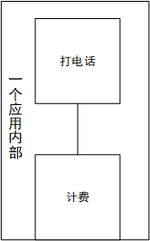
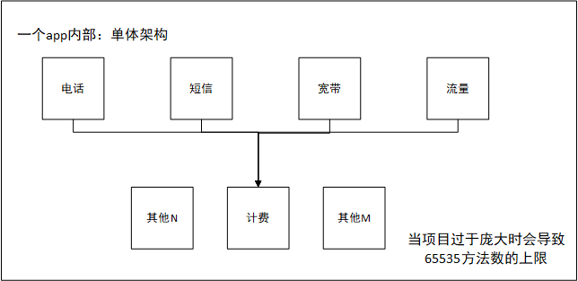
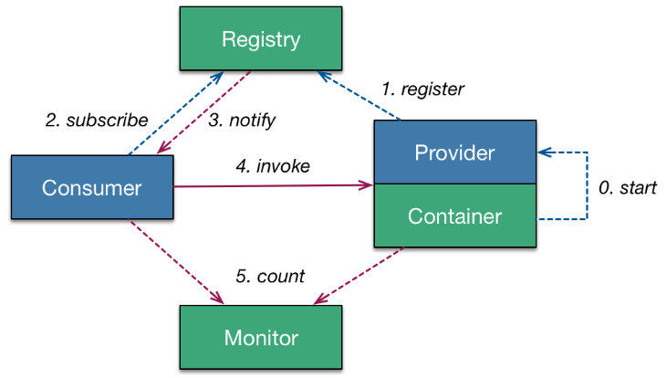

# Dubbo分布式服务框架

Dubbo是是一个高性能，基于Java的RPC框架，由阿里巴巴开源。一个分布式的服务框架。可以实现SOA（面向服务的架构）架构。 Dubbo使用的公司：京东、当当、阿里巴巴、中国电信等等。

## 分布式服务架构的由来

以下式架构演变过程（以下案例纯粹为了说明问题，跟业务本身无关）：

早期，电信只有座机的时候，系统只有一个打电话的功能和一个计费的功能。因为业务单一，所以只有一个系统。

- 单一业务的单体式架构



后来，电信业务丰富起来了。新增了“短信”、“宽带”、“手机流量”等业务功能。按照常规做法，也只会在原有的“打电话”单一业务系统的基础上，多添加几个业务功能模块而已。所有的业务功能（““电话”、“短信”、“宽带”、“手机流量””）都还是在一个项目内部。如下图：

- 多业务单体式架构



多业务模式下的单体架构，当业务不断扩张、系统内部的业务功能模块越来越多，会导致如下问题：

1、会导致业务功能模块的耦合度太高、不利于扩展和维护，以及推广。

2、再者程序中存在一个魔性的数字：65535（16bit最大值）限制，（因为调用方法的指令容量只有16bit，65535正好是16bit能容纳的最大数字）。重复的方法数太多，会加速达到这个上限。（比如Android 应用65535很容易就上限了）。

比如淘宝、天猫、阿里巴巴三个项目都需要用到支付，设想，将淘宝、天猫、阿里巴巴三个项目整合成一个项目的三个业务功能模块，将会比较杂乱。所以，出现了淘宝、天猫、阿里巴巴三个独立的项目，类似下图：

- 垂直架构


通过一步一步演变，架构已经成为如图所示的垂直式架构。但是大家都发现了其中的计费功能出现了4次。这样肯定不利于项目的维护和统一配置。（并且上图的计费只是众多可能重复模块中的一员）。所以不得不将多个项目都要使用的相同模块独立出来，共享给业务功能使用。这样，就演变成如下图架构：


如图所示，计费被单独提炼出来成为一个独立的app，共其他app共同使用。图中“其他”模块用来代替千千万万类似计费的模块。

这样一来，每一个方块就是一个独立的应用。这样解决了业务复杂度，将业务模块化、独立化，方便共享和扩展。这样的架构带给我们需要解决的问题如下：

1、各个独立app之间的通信问题怎么解决？

2、怎么做到统一调度、协调处理。

3、如果计费模块是并发最大的模块，但是其他模块并发不是很大。则需要对计费进行负载均衡，怎么实现？


## 架构演变过程


## 什么是RPC？
RPC（Remote Procedure Call Protocol）远程过程调用协议。服务器A调用服务器B上的方法的一种技术。Dubbo就是一个RPC框架，实现了远程过程调用。


## Dubbo的原理图



dubbo主要的三个要素：
1、接口的远程调用
2、负载均衡。
3、服务自动注册和发现

## Dubbo的使用
### 1、说明
Dubbo框架需要有注册中心，本案例中使用Redis作为Dubbo的注册中心。除了Redis外，Zookeeper等也可以作为Dubbo的注册中心。

### 2、环境要求
JDK 1.6以上。

### 3、添加依赖
```
<dependencies>
        <!-- https://mvnrepository.com/artifact/com.alibaba/dubbo -->
        <dependency>
            <groupId>com.alibaba</groupId>
            <artifactId>dubbo</artifactId>
            <version>2.5.5</version>
        </dependency>
        <dependency>
            <groupId>redis.clients</groupId>
            <artifactId>jedis</artifactId>
            <version>2.9.0</version>
        </dependency>
        <dependency>
            <groupId>org.springframework.data</groupId>
            <artifactId>spring-data-redis</artifactId>
            <version>1.8.4.RELEASE</version>
        </dependency>
        <dependency>
            <groupId>org.springframework</groupId>
            <artifactId>spring-context</artifactId>
            <version>4.3.11.RELEASE</version>
        </dependency>
        <dependency>
            <groupId>junit</groupId>
            <artifactId>junit</artifactId>
            <version>4.12</version>
        </dependency>
        <dependency>
            <groupId>org.springframework</groupId>
            <artifactId>spring-test</artifactId>
            <version>4.3.11.RELEASE</version>
        </dependency>
    </dependencies>
```

### 4、定义Dubbo服务接口
其实就是创建一个独立的module（并且在pom.xml导入以上依赖），在module中创建一些接口和方法（也叫服务）。
比如在dubbo_service_interface中创建一个接口IDubboService，代码如下:
```
package com.javen.dubbo.service;

import java.util.List;

/**
 * Dubbo的服务
 * @author yangjw 
 */
public interface IDubboService {

    List<String> getData(String data);

}

```

### 5、定义服务提供者（接口具体实现者）
创建另外一个module，命名dubbo_provider1（并且在pom.xml导入以上依赖）。将dubbo_service_interface作为依赖添加进来。

1、在其中创建类DubboService，并且继承IDubboService接口。代码如下：
```
package com.javen.dubbo.provider;

import com.javen.dubbo.service.IDubboService;
import org.springframework.stereotype.Component;

import java.util.ArrayList;
import java.util.List;

/**
 * 服务提供者
 * @author yangjw 
 */
@Component("dubboService")
public class DubboService implements IDubboService{


    public List<String> getData(String data) {

        ArrayList<String> list = new ArrayList<String>();
        list.add("这是Dubbo中Provider返回的数据：" + data);
        return list;
    }
}

```
2、配置spring-dubbo.xml,代码如下：

```
<?xml version="1.0" encoding="UTF-8"?>
<beans xmlns="http://www.springframework.org/schema/beans"
       xmlns:xsi="http://www.w3.org/2001/XMLSchema-instance"
       xmlns:context="http://www.springframework.org/schema/context"
       xmlns:dubbo="http://code.alibabatech.com/schema/dubbo"
       xsi:schemaLocation="http://www.springframework.org/schema/beans
                            http://www.springframework.org/schema/beans/spring-beans.xsd
                            http://www.springframework.org/schema/context
                            http://www.springframework.org/schema/context/spring-context.xsd http://code.alibabatech.com/schema/dubbo http://code.alibabatech.com/schema/dubbo/dubbo.xsd">

    <context:annotation-config/>
    <context:component-scan base-package="com.javen.dubbo.provider"/>
    <!--配置dubbo服务的唯一名称 -->
    <dubbo:application name="dubbo_provider1"/>
    <!--将服务注册到redis中，并且配置协议和端口为20880-->
    <dubbo:registry address="redis://192.168.72.188:6379"/>
    <dubbo:protocol name="dubbo" port="20880"/>
    <!--配置服务接口，ref关联到服务实现类-->
    <dubbo:service interface="com.javen.dubbo.service.IDubboService" ref="dubboService"/>

</beans>
```

3、启动Provider,代码如下：
```
package com.javen.dubbo.provider;

import org.springframework.context.support.ClassPathXmlApplicationContext;

import java.io.IOException;

public class StartProvider {

    public static void main(String[] args) throws IOException {
        ClassPathXmlApplicationContext context = new ClassPathXmlApplicationContext(
                new String[] {"spring-dubbo.xml"});
        System.out.println("服务1启动~~~");
        context.start();
        //线程阻塞：保证服务一直存在，如果线程结束，服务终止
        System.in.read(); // press any key to exit
    }
}

```


### 6、定义服务消费者（接口的具体调用者）

再创建一个module，命名dubbo_consumer（并且在pom.xml导入以上依赖）。将dubbo_service_interface作为依赖添加进来。

1、配置spring-dubbo.xml,代码如下：
```
<?xml version="1.0" encoding="UTF-8"?>
<beans xmlns="http://www.springframework.org/schema/beans"
       xmlns:xsi="http://www.w3.org/2001/XMLSchema-instance"
       xmlns:dubbo="http://code.alibabatech.com/schema/dubbo"
       xsi:schemaLocation="http://www.springframework.org/schema/beans
                            http://www.springframework.org/schema/beans/spring-beans.xsd
                             http://code.alibabatech.com/schema/dubbo http://code.alibabatech.com/schema/dubbo/dubbo.xsd">


    <dubbo:application name="demo-consumer"/>
    <dubbo:registry address="redis://192.168.72.188:6379"/>
    <dubbo:reference id="demoService" interface="com.javen.dubbo.service.IDubboService"/>
</beans>
```

2、测试
```
package com.test;

import com.javen.dubbo.service.IDubboService;
import org.junit.Test;
import org.junit.runner.RunWith;
import org.springframework.beans.factory.annotation.Autowired;
import org.springframework.test.context.ContextConfiguration;
import org.springframework.test.context.junit4.SpringJUnit4ClassRunner;

import javax.annotation.Resource;
import java.util.List;

@RunWith(SpringJUnit4ClassRunner.class)
@ContextConfiguration("classpath:spring-dubbo.xml")
public class DubboTest {

    @Resource(name = "demoService")
    private IDubboService dubboService;
    @Test
    public void testDubbo(){
        List<String> haha = dubboService.getData("haha");
        System.out.println(haha.get(0));
    }
}

```

## Dubbo、MyCat、主从配置\读写分离、redis分布式、JTA分布式事务的关系。


dubbo默认每次只访问一个服务器，需要主从配合完成数据同步。
```
<!--replicate可以实现所有服务器同步写，但是只读取单台服务器。默认是failover，读写都是单台服务器-->
    <dubbo:registry cluster="replicate" address="redis://192.168.72.188:6379"/>
```